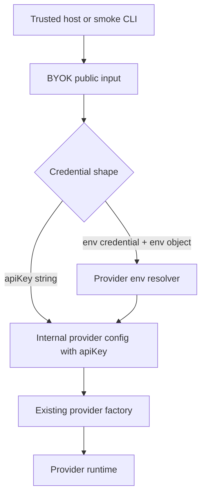

# Env-Backed Provider Credentials - Plan

## Goal Capsule

| Field             | Value                                                                                                                                                                            |
| ----------------- | -------------------------------------------------------------------------------------------------------------------------------------------------------------------------------- |
| Objective         | Add explicit env-backed credential support for standard API-key providers and use it from a provider smoke CLI.                                                                  |
| Product authority | User request on 2026-07-06, the provider smoke harness ideation artifact, the current public facade, and the BYOK boundary that credentials flow through trusted runtime inputs. |
| Execution profile | LFG pipeline, single implementation branch, code plus docs and tests.                                                                                                            |
| Stop conditions   | Stop if implementation would require `.env` parsing, browser secret handling, provider model semantics changes, or custom env variable naming.                                   |
| Tail ownership    | LFG owns implementation, simplification, review, browser-test applicability, commit, push, PR creation, and CI watch.                                                            |

---

## Product Contract

### Summary

`byok-runtime` will own the standard provider env-var convention while keeping env lookup opt-in at the call site.
Explicit API-key input remains the primary BYOK path; env-backed usage is a convenience for local scripts, smoke tooling, and trusted Node-style runtimes.

### Problem Frame

The provider smoke harness needs the same standard API-key env var map that users expect from provider SDKs.
Keeping that map only in the harness would duplicate provider knowledge outside the library, but silently falling back to ambient process state would weaken BYOK's current posture that credentials are explicit runtime inputs.
The useful middle path is a library-owned env convention with an opt-in call shape that receives an environment object from the host.

### Requirements

**Credential resolution**

- R1. Cloud providers support an explicit env-backed credential mode that resolves the provider API key from standard environment variable names.
- R2. Explicit `apiKey` credentials remain supported and take precedence whenever the caller chooses the existing API-key path.
- R3. Env-backed resolution fails with a provider-specific missing-credential error when no supported env var is present.
- R4. Env-backed resolution never persists, logs, or returns secret values.

**Provider conventions**

- R5. Anthropic resolves `ANTHROPIC_API_KEY`.
- R6. OpenAI resolves `OPENAI_API_KEY`.
- R7. Google resolves `GOOGLE_API_KEY` before `GEMINI_API_KEY`.
- R8. xAI resolves `XAI_API_KEY`.
- R9. OpenRouter resolves `OPENROUTER_API_KEY`.
- R10. Ollama remains URL-backed and does not gain an API-key env credential mode.

**Runtime and tooling fit**

- R11. Env-backed credential resolution works for text generation, model listing, credential-bound clients, and provider smoke tooling.
- R12. The smoke harness uses the library-owned env credential mode instead of defining its own provider env map.
- R13. Documentation distinguishes explicit API-key usage for host apps from env-backed usage for trusted local scripts and examples.
- R14. Type-level examples make the opt-in env-backed path visible enough that callers do not confuse it with secret storage or browser-safe usage.
- R15. Documentation or smoke harness help includes command-line examples for env-backed generation, explicit key usage, Google env precedence, and Ollama URL-backed usage.

### Acceptance Examples

- AE1. **Covers:** R1, R3, R5. **Given** Anthropic env-backed mode and no `ANTHROPIC_API_KEY`, **when** a caller lists models, **then** BYOK fails before the provider call with an Anthropic-specific missing-credential message.
- AE2. **Covers:** R1, R7. **Given** Google env-backed mode with both `GOOGLE_API_KEY` and `GEMINI_API_KEY`, **when** a caller generates text, **then** BYOK uses `GOOGLE_API_KEY`.
- AE3. **Covers:** R2. **Given** the existing explicit API-key path, **when** a caller passes an API key, **then** BYOK uses that value and does not require any provider env var.
- AE4. **Covers:** R10. **Given** Ollama generation without a URL, **when** a caller generates text, **then** BYOK continues to use the default local Ollama URL behavior rather than API-key env lookup.
- AE5. **Covers:** R12. **Given** the provider smoke CLI generates text for OpenAI without a `--api-key` value, **when** `OPENAI_API_KEY` is set, **then** the harness delegates env resolution to BYOK and prints the response.

### Example Command-Line Calls

These examples define the desired usage shape for the provider smoke harness; implementation may choose the exact script wiring that best fits the package.

```bash
# Generate with OpenAI using the standard environment variable.
OPENAI_API_KEY="<OPENAI_API_KEY>" bun run provider-smoke generate \
	--provider openai \
	--model gpt-4o-mini \
	--input "Reply with one short sentence."

# List Anthropic models with an explicit key instead of environment lookup.
bun run provider-smoke models \
	--provider anthropic \
	--api-key "<ANTHROPIC_API_KEY>"

# List Google models; GOOGLE_API_KEY wins when both Google env vars exist.
GOOGLE_API_KEY="<GOOGLE_API_KEY>" GEMINI_API_KEY="<GEMINI_API_KEY>" \
	bun run provider-smoke models --provider google

# Generate with Ollama using the default local URL.
bun run provider-smoke generate \
	--provider ollama \
	--model llama3.1:8b \
	--input "Write one sentence about local inference."

# List Ollama models from an explicit local or LAN URL.
bun run provider-smoke models \
	--provider ollama \
	--url http://127.0.0.1:11434
```

### Success Criteria

- The public API still nudges application code toward deliberate credential handling.
- Local script examples no longer need to hand-roll provider-specific env var checks.
- The provider smoke harness can exercise all requested API-key providers without duplicating the env map.
- The provider smoke harness examples make env-backed and explicit-key calls easy to copy without implying `.env` file loading.
- Tests cover missing env vars, Google precedence, explicit-key preservation, and Ollama non-participation.

### Scope Boundaries

- This plan does not add `.env` file parsing.
- This plan does not support custom env var names in the first version.
- This plan does not change model selection, model-list semantics, provider ordering, or local CLI provider credential handling.
- This plan does not make browser or Electron renderer usage safe for provider secrets.

---

## Planning Contract

### Key Technical Decisions

- KTD1. **Use a separate env credential object.** The public cloud-provider input shape adds `credential: { source: "env"; env: ByokEnvironment }` alongside the existing `apiKey: string` path, so env-backed calls are obvious and explicit-key calls remain source-compatible.
- KTD2. **Require the host-provided environment object.** Env-backed mode reads from the `env` object on the credential rather than importing `process.env`, which keeps the main entrypoint process-free and makes tests deterministic; Node scripts can pass `process.env`.
- KTD3. **Resolve before provider construction.** Public facade helpers convert env-backed input into the existing internal provider config with a concrete `apiKey`, so provider classes and transport adapters do not learn about env sources.
- KTD4. **Keep provider env names as exported data.** A single library-owned map drives credential resolution, docs, and the smoke CLI, with Google ordered as `GOOGLE_API_KEY` then `GEMINI_API_KEY`.
- KTD5. **Put smoke tooling under an example package with root convenience script.** `examples/provider-smoke` carries its own `package.json` and CLI source, while root `bun run provider-smoke` makes the documented examples copyable from the repository root.

### Assumptions

- The first env-backed API does not need custom env var names; adding them later can extend the credential object without changing explicit-key calls.
- The smoke CLI can use Bun and TypeScript directly because the repository already standardizes on Bun and TypeScript for development commands.
- Network-backed smoke calls are manual verification aids; automated tests should cover parsing and BYOK delegation without calling external providers.

### High-Level Technical Design



### Output Structure

```text
examples/provider-smoke/
  package.json
  src/cli.ts
  README.md
```

### Documentation / Operational Notes

The README and API reference should show env-backed mode as a trusted-runtime convenience, not as a replacement for explicit credential handling in apps.
The smoke CLI help and README should include copyable commands for env-backed generation, explicit-key listing, Google precedence, and Ollama URL-backed listing.

### Risks & Dependencies

- **Public type churn:** Changing `ByokCloudProviderConfig` into a union may affect downstream type narrowing; public contract tests and fixture typecheck must prove the existing explicit-key examples still compile.
- **Secret exposure in errors:** Missing-credential errors should name provider and env variable names only, never observed values.
- **Provider smoke network dependency:** Smoke commands call real providers; automated verification should validate CLI argument handling and BYOK call construction without requiring live API keys.

### Sources / Research

- `src/types.ts` currently requires `apiKey: string` for `ByokCloudProviderConfig`.
- `src/client.ts` currently passes explicit `apiKey` values through the public facade for generation, listing, and credential-bound clients.
- `src/providers/provider-factory.ts` currently expects a resolved API key for each cloud provider, which supports resolving env-backed credentials one layer earlier.
- `README.md` currently resolves `OPENAI_API_KEY` in examples before calling BYOK and states that BYOK receives credentials as call inputs.
- `docs/ideation/2026-07-06-byok-runtime-provider-test-harness-ideation.html` ranked a provider smoke harness as the preferred testing surface and made env-var mapping a shared concern.

---

## Implementation Units

### U1. Add Env Credential Types And Resolver

- **Goal:** Introduce the explicit env credential shape, provider env map, and resolver that converts supported cloud providers to API keys.
- **Requirements:** R1, R3, R4, R5, R6, R7, R8, R9, R10, R14; covers AE1 and AE2.
- **Dependencies:** None.
- **Files:** `src/types.ts`, `src/credentials.ts`, `src/index.ts`, `tests/env-credentials.test.ts`, `tests/public-contract.test.ts`.
- **Approach:** Add `ByokEnvironment`, `ByokEnvCredential`, and cloud-provider config unions that preserve `apiKey: string` for the existing path and add `credential: { source: "env"; env: ByokEnvironment }` for env-backed calls. Add resolver helpers that accept only cloud providers, use the library-owned env name map, trim no values beyond checking presence consistently with current API-key expectations, and throw `ByokProviderError` with provider/env names when missing.
- **Execution note:** Add focused failing resolver tests before wiring the facade.
- **Patterns to follow:** `src/types.ts` exported type style, `src/providers/default-deps.ts` error style, `tests/public-contract.test.ts` export-surface assertions.
- **Test scenarios:** Covers AE1. Resolving Anthropic with an empty env object throws a `ByokProviderError` naming `ANTHROPIC_API_KEY` and not including a secret value. Covers AE2. Resolving Google with both Google env vars returns the `GOOGLE_API_KEY` value. Resolving OpenAI, xAI, and OpenRouter returns values from their standard env vars. Attempting env credential resolution for Ollama is impossible through the public type shape and not represented in the resolver map.
- **Verification:** Resolver unit tests pass; public contract tests show only intentional new exports; explicit API-key config examples still compile.

### U2. Wire Env Credentials Through The Public Facade

- **Goal:** Make `generateText`, `listModels`, and `createByok` accept env-backed cloud credentials while keeping provider factory inputs resolved to API keys.
- **Requirements:** R1, R2, R3, R4, R7, R11, R14; covers AE2 and AE3.
- **Dependencies:** U1.
- **Files:** `src/client.ts`, `src/types.ts`, `tests/client-factory.test.ts`, `tests/fixtures/main-entrypoint.ts`, `tests/public-contract.test.ts`.
- **Approach:** Route every public cloud config through a small resolver before calling `createByokProvider`. Preserve Ollama and explicit API-key branches. Keep `createByokProvider` and provider classes unchanged by passing them a resolved `ByokCoreProviderConfig`.
- **Execution note:** Strengthen existing client-factory tests first so they prove the resolved config passed to the provider factory.
- **Patterns to follow:** Existing `providerConfigFromGenerateTextOptions`, `providerConfigFromClientInput`, and `providerConfigFromListModelsOptions` helpers in `src/client.ts`.
- **Test scenarios:** Covers AE3. Existing explicit-key generation, listing, and client creation pass the provided key through unchanged. Covers AE2. Env-backed Google generation passes the `GOOGLE_API_KEY` value to `createByokProvider` when both Google env vars exist. Env-backed missing OpenAI credentials fail before provider factory creation. Env-backed listing and `createByok` use the same resolver as generation.
- **Verification:** Client-factory tests pass; type fixture proves env-backed examples compile; provider-factory tests remain unchanged except for type compatibility if needed.

### U3. Add Provider Smoke CLI Example

- **Goal:** Add a small example package and CLI that lists models or generates text across all current public providers using either `--api-key` or BYOK env-backed credentials.
- **Requirements:** R10, R11, R12, R15; covers AE4 and AE5.
- **Dependencies:** U1, U2.
- **Files:** `examples/provider-smoke/package.json`, `examples/provider-smoke/src/cli.ts`, `examples/provider-smoke/README.md`, `package.json`, `tests/provider-smoke-cli.test.ts`.
- **Approach:** Implement `models` and `generate` commands with flags for `--provider`, `--model`, `--input`, `--api-key`, and `--url`. Cloud providers with `--api-key` call BYOK's explicit-key path; cloud providers without `--api-key` call BYOK's env-backed path with `process.env`; Ollama uses URL-backed config and rejects `--api-key`. Model listing prints the first five model IDs, and generation prints the provider response text.
- **Execution note:** Prefer parser and delegation tests over live provider calls; real API smoke testing remains manual.
- **Patterns to follow:** Root Bun script style in `package.json`, current README command examples, public facade imports from `src/index.ts` while developing in-repo.
- **Test scenarios:** Covers AE5. OpenAI generate without `--api-key` builds an env-backed BYOK call and prints returned text when `OPENAI_API_KEY` is present in the supplied process env. Anthropic models with `--api-key` builds an explicit-key BYOK call and prints only the first five models. Covers AE4. Ollama generate without `--url` uses the default URL path and never requests env credentials. Invalid provider or missing required `--model` / `--input` returns a non-zero CLI result with help text.
- **Verification:** CLI tests pass without external network; root `provider-smoke` script is available; example README commands match actual flags.

### U4. Update Documentation And API Reference

- **Goal:** Document env-backed credentials and the provider smoke CLI without weakening the BYOK security posture.
- **Requirements:** R4, R10, R13, R14, R15.
- **Dependencies:** U1, U2, U3.
- **Files:** `README.md`, `API.md`, `tests/public-contract.test.ts`, `tests/fixtures/main-entrypoint.ts`.
- **Approach:** Add env-backed examples near current explicit-key examples, keep explicit-key examples as the first-success path, and add a smoke harness section with the command-line examples from the Product Contract. Update API reference exports and type descriptions for the new credential helpers and types.
- **Patterns to follow:** Existing README sections for quickstart, `createByok`, and model discovery; `API.md` public API listing style.
- **Test scenarios:** Type fixture includes env-backed `generateText`, `listModels`, and `createByok` examples. Public contract tests assert the intentional exported helper/type names and no accidental node-only exports from the main entrypoint.
- **Verification:** Docs mention no `.env` loading, explain Google precedence, and keep browser/renderer secret warnings intact; typecheck examples pass.

---

## Verification Contract

| Gate                                                                                                          | Applies to | Done signal                                                                                |
| ------------------------------------------------------------------------------------------------------------- | ---------- | ------------------------------------------------------------------------------------------ |
| `bun run test -- tests/env-credentials.test.ts tests/client-factory.test.ts tests/provider-smoke-cli.test.ts` | U1, U2, U3 | Focused behavior and CLI delegation tests pass.                                            |
| `bun run typecheck:examples`                                                                                  | U1, U2, U4 | Public TypeScript fixture compiles with explicit-key and env-backed examples.              |
| `bun run test -- tests/public-contract.test.ts tests/provider-factory.test.ts`                                | U1, U2, U4 | Public export surface and provider factory behavior remain intentional.                    |
| `bun run check`                                                                                               | Whole plan | Formatting, lint, build, typecheck, package readiness, publint, attw, and full tests pass. |

Manual provider smoke commands are optional because they require live API keys or a local Ollama daemon.

---

## Definition of Done

- U1 is done when the env credential map and resolver are exported intentionally, tested for all cloud providers, and cannot apply to Ollama.
- U2 is done when generation, model listing, and credential-bound clients resolve env-backed cloud credentials before provider construction while preserving explicit-key behavior.
- U3 is done when the provider smoke CLI supports `models` and `generate`, first-five model output, explicit keys, env-backed cloud providers, and Ollama URL-backed usage with automated delegation tests.
- U4 is done when README and API docs describe the new credential mode, command-line examples are accurate, and security guidance still states that browser/renderer secret handling is out of scope.
- The implementation is done when planned tests pass, `bun run check` passes or any failure is documented as out of scope, abandoned attempt code is removed, and review findings are either fixed or durably recorded by LFG.
