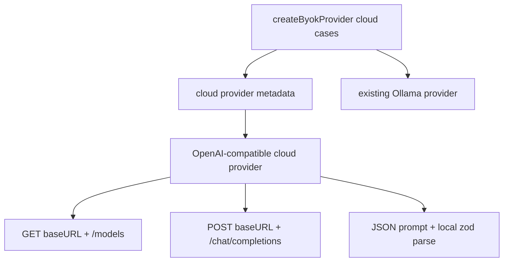

# refactor: Use one OpenAI-compatible cloud provider runtime

## Goal Capsule

| Field             | Value                                                                                                                                                    |
| ----------------- | -------------------------------------------------------------------------------------------------------------------------------------------------------- |
| Objective         | Replace the separate Anthropic, OpenAI, Google, xAI, and OpenRouter cloud provider implementations with one OpenAI-compatible runtime backed by `fetch`. |
| Authority         | User request, existing public provider contract, existing tests, official provider OpenAI-compatible API docs.                                           |
| Execution profile | One branch, one PR, no stacked PRs.                                                                                                                      |
| Stop conditions   | Stop if a provider cannot preserve the current `AiProvider` behavior through its OpenAI-compatible API without reintroducing provider-specific SDKs.     |
| Tail ownership    | LFG implements, verifies, reviews, commits, pushes, opens PR, then watches CI when available.                                                            |

---

## Product Contract

### Summary

The runtime should keep the same user-facing BYOK cloud providers while reducing provider SDK surface area.
Cloud generation and model listing should flow through one OpenAI-compatible implementation; Ollama stays separate because it is not part of the cloud OpenAI-compatible set.

### Problem Frame

The package currently depends on Vercel AI SDK provider adapters plus native Anthropic, Google, and OpenAI SDKs to serve provider paths that can mostly speak the OpenAI API.
That creates dependency weight, browser-key flags such as `dangerouslyAllowBrowser`, and five near-duplicate provider classes.

### Requirements

- R1. Preserve the existing public provider IDs, labels, connection checks, model listing shape, text generation shape, and object generation shape for `anthropic`, `openai`, `google`, `xai`, and `openrouter`.
- R2. Route cloud provider model listing and generation through one shared OpenAI-compatible provider implementation using the repo's injected `fetchImpl`.
- R3. Remove cloud SDK dependencies made obsolete by the shared implementation.
- R4. Keep Ollama behavior and dependency decisions out of scope unless a type or test import must change because of cloud cleanup.
- R5. Preserve current testability hooks for generation and model listing so unit tests do not need live provider credentials.
- R6. Record provider compatibility limits in code through scoped tests rather than adding provider-specific abstractions for unproven needs.

### Scope Boundaries

#### In Scope

- Cloud provider class consolidation under `src/providers/`.
- Provider factory rewiring for existing cloud provider configs.
- Dependency and lockfile cleanup for removed cloud SDKs.
- Tests covering shared cloud provider behavior and provider-specific metadata/base URLs/model-list normalization.

#### Deferred to Follow-Up Work

- Replacing the `ollama` package with direct `/api/tags` calls.
- Adding provider-specific advanced capabilities such as Anthropic prompt caching, Google media APIs, or OpenRouter ranking headers.
- Changing public configuration types or provider IDs.

---

## Planning Contract

### Key Technical Decisions

- KTD1. Use direct OpenAI-compatible HTTP over `fetch`. The repo already injects `fetchImpl`, and direct HTTP removes the need for `openai`, Vercel AI SDK provider adapters, and browser-specific SDK escape hatches.
- KTD2. Keep one metadata table for cloud providers. Provider differences should be data: `id`, label, vendor, base URL, model-list path behavior, and optional model label mapping.
- KTD3. Reuse the existing JSON-only prompt and `schema.parse` pattern for object generation. Anthropic documents that OpenAI-compatible `response_format` is ignored, so schema enforcement must remain local rather than assuming provider-enforced strict JSON.
- KTD4. Keep model listing simple. OpenAI, Google, xAI, and Anthropic can use `/models`; OpenRouter keeps its richer label normalization from `/models`.
- KTD5. Delete provider-specific files only after factory and tests no longer import them. This keeps the diff surgical and avoids unrelated CLI/Ollama churn.

### High-Level Technical Design

### Assumptions

- A plain chat-completions request is sufficient for current text and object generation behavior.
- Existing object generation callers can tolerate local JSON parsing with provider prompt guidance, matching the current OpenRouter fallback strategy.
- Official OpenAI-compatible endpoints remain available for the providers in scope, but provider-specific feature gaps are not solved in this refactor.

### Sources and Research

- Existing provider shape: `src/providers/ai-sdk-provider.ts`, `src/providers/openrouter-provider.ts`, `src/providers/provider-factory.ts`.
- Existing tests: `tests/ai-sdk-providers.test.ts`, `tests/anthropic-provider.test.ts`, `tests/provider-factory.test.ts`.
- Anthropic OpenAI compatibility docs: `https://platform.claude.com/docs/en/cli-sdks-libraries/libraries/openai-sdk`.
- Google Gemini OpenAI compatibility docs: `https://ai.google.dev/gemini-api/docs/openai`.
- xAI overview with OpenAI client example: `https://docs.x.ai/overview`.
- OpenRouter quickstart with OpenAI base URL: `https://openrouter.ai/docs/quickstart`.

---

## Implementation Units

### U1. Add the Shared Cloud Provider

- **Goal:** Introduce one OpenAI-compatible cloud provider class that implements the current `AiProvider` contract for all cloud providers.
- **Requirements:** R1, R2, R5, R6.
- **Dependencies:** None.
- **Files:** `src/providers/openai-compatible-provider.ts`, `tests/openai-compatible-provider.test.ts`.
- **Approach:** Move the shared retry/error behavior from `AiSdkProvider` into the new provider or reuse it if the dependency boundary stays clean. Implement text generation with `/chat/completions`, object generation with JSON-only prompting plus `schema.parse`, and model listing with injected fetch.
- **Patterns to follow:** `src/providers/ai-sdk-provider.ts` for `testConnection`, retry, and error mapping; `src/providers/openrouter-provider.ts` for JSON prompt cleanup and schema parsing.
- **Test scenarios:** Instantiate the shared provider for each cloud metadata entry and verify `id`, `label`, `generateText`, `generateObject`, `testConnection`, retry-on-429, exhausted rate-limit error, auth error messaging, abort propagation, and model-list normalization.
- **Verification:** Unit tests prove the shared provider matches existing cloud behavior without live network calls.

### U2. Rewire Cloud Provider Construction

- **Goal:** Replace five cloud provider branches in the factory with metadata-driven construction of the shared provider.
- **Requirements:** R1, R2, R4.
- **Dependencies:** U1.
- **Files:** `src/providers/provider-factory.ts`, `src/providers/openai-provider.ts`, `src/providers/anthropic-provider.ts`, `src/providers/google-provider.ts`, `src/providers/xai-provider.ts`, `src/providers/openrouter-provider.ts`, `tests/provider-factory.test.ts`, `tests/ai-sdk-providers.test.ts`, `tests/anthropic-provider.test.ts`.
- **Approach:** Add provider metadata for Anthropic, OpenAI, Google, xAI, and OpenRouter. Delete provider-specific classes once tests import the shared provider or factory instead.
- **Patterns to follow:** Existing `createByokProvider` config switch and `resolveByokFetchDeps`.
- **Test scenarios:** Factory creates every cloud runtime with the same IDs and labels as before; provider-specific base URLs are exercised through mocked fetch calls; Ollama factory tests remain unchanged.
- **Verification:** Factory and cloud provider tests pass with no imports from deleted provider classes.

### U3. Remove Obsolete SDK Types and Model Helpers

- **Goal:** Remove native SDK type dependencies left behind by model-list conversion.
- **Requirements:** R3, R4.
- **Dependencies:** U1, U2.
- **Files:** `src/models/anthropic-models.ts`, `tests/anthropic-models.test.ts`, `src/types/sdk-browser-shims.d.ts`.
- **Approach:** Replace `@anthropic-ai/sdk` `ModelInfo` usage with a local minimal model shape. Delete browser shims that only exist for removed SDK imports.
- **Patterns to follow:** `src/models/model-options.ts` for portable `ByokModelOption` handling.
- **Test scenarios:** Anthropic model option tests still cover fetched models, duplicate filtering, custom model fallback, and friendly labels using the local shape.
- **Verification:** Typecheck passes without native Anthropic or Google SDK imports.

### U4. Clean Dependencies and Lockfile

- **Goal:** Remove cloud SDK dependencies that are no longer imported.
- **Requirements:** R3.
- **Dependencies:** U1, U2, U3.
- **Files:** `package.json`, `bun.lock`.
- **Approach:** Remove `@ai-sdk/anthropic`, `@ai-sdk/google`, `@ai-sdk/openai`, `@ai-sdk/provider-utils`, `@ai-sdk/xai`, `@anthropic-ai/sdk`, `@google/genai`, `ai`, and `openai` if import scans confirm they are unused. Keep `zod`, `tslib`, and `ollama`.
- **Patterns to follow:** Existing package dependency grouping.
- **Test scenarios:** Import scan finds no removed package names outside lockfile churn before lockfile regeneration; package manager install/update refreshes `bun.lock`.
- **Verification:** `bun install` completes and `rg` confirms removed cloud SDK packages are no longer imported by source or tests.

### U5. Run Focused and Package Verification

- **Goal:** Prove the refactor did not break the published runtime contract.
- **Requirements:** R1, R3, R5.
- **Dependencies:** U1, U2, U3, U4.
- **Files:** `tests/*`, `package.json`, `bun.lock`.
- **Approach:** Run targeted provider tests first, then the repo's broader checks that are practical in the environment.
- **Patterns to follow:** Existing `package.json` scripts.
- **Test scenarios:** Existing public-contract and factory tests pass; cloud provider tests pass; typecheck catches stale dependency types.
- **Verification:** At minimum run `bun test tests/openai-compatible-provider.test.ts tests/provider-factory.test.ts tests/anthropic-models.test.ts` and `bun run typecheck`; run `bun run check` if time and environment allow.

---

## Verification Contract

| Gate                    | Applies To | Done Signal                                                                                                |
| ----------------------- | ---------- | ---------------------------------------------------------------------------------------------------------- |
| Targeted provider tests | U1, U2, U3 | Cloud provider, factory, and Anthropic model tests pass without live credentials.                          |
| Typecheck               | U1-U4      | No stale imports or exported type regressions remain.                                                      |
| Dependency scan         | U4         | Removed cloud SDK package names do not appear in source/test imports.                                      |
| Full package check      | U5         | `bun run check` passes, or any environment-specific failure is documented with the narrower passing gates. |

---

## Definition of Done

- One shared cloud provider implementation handles Anthropic, OpenAI, Google, xAI, and OpenRouter.
- Ollama behavior is unchanged.
- Obsolete cloud SDK dependencies are removed from `package.json` and `bun.lock`.
- Existing public provider IDs and runtime construction behavior are preserved.
- Tests cover provider metadata, model listing, text generation, object generation, retry/rate-limit behavior, and auth failure mapping.
- Abandoned provider-specific files, imports, shims, and test helpers introduced by the old approach are removed.
