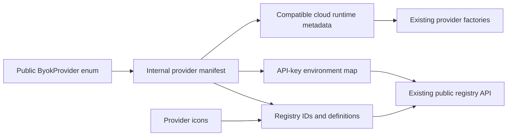

# Executable Provider Manifest - Plan

## Goal Capsule

Create one internal, executable provider manifest that is the authoritative source for provider ordering, public definitions, API-key environment variables, and OpenAI-compatible cloud runtime metadata. Preserve every current public export and runtime behavior while removing the repeated hand-maintained provider metadata that makes future provider expansion error-prone.

**Authority order:** this plan, the linked ideation artifact, current public-contract tests, then existing implementation conventions.

**Execution profile:** one focused refactor phase on `feat/executable-provider-manifest`; implementation, tests, commit, push, and pull request are owned by LFG.

**Stop condition:** stop if preserving the public `ByokProvider` enum requires a breaking export or if a manifest field would need to encode provider construction behavior rather than declarative metadata.

---

## Product Contract

### Summary

Provider metadata is declared once and consumed by registry, credential resolution, and compatible-cloud construction. Existing callers observe no changed provider IDs, ordering, labels, credentials, endpoints, headers, model normalization, or exported runtime values.

### Problem Frame

Adding a provider currently requires synchronized edits across `src/types.ts`, `src/registry.ts`, `src/credentials.ts`, `src/provider-icons.ts`, `src/providers/provider-factory.ts`, and contract tests. These surfaces can drift because the compiler validates each map locally but does not prove that they describe the same provider inventory or classification.

### Requirements

- **R1.** A single internal manifest lists every current provider in stable public order and carries its public definition plus only the runtime metadata relevant to its provider family.
- **R2.** `BYOK_PROVIDER_IDS`, `BYOK_PROVIDER_DEFINITIONS`, and `BYOK_PROVIDER_API_KEY_ENV_VARS` are derived from or mechanically validated against the manifest without changing their public values or types.
- **R3.** OpenAI-compatible cloud construction reads endpoint, label, vendor, and closed declarative header/model-normalization strategies from the manifest rather than a second cloud metadata table.
- **R4.** Local-server and CLI providers remain explicit construction paths; the manifest classifies them but does not store constructors or executable callbacks unrelated to declarative provider metadata.
- **R5.** Tests fail when a provider is missing a required family-specific field, appears in the wrong order, or is omitted from a derived public surface.
- **R6.** No new public export is introduced for the internal manifest, and the existing main/node entrypoint boundaries remain unchanged.

### Acceptance Examples

- Given the current manifest, `byokProviderDefinitions().map(({ id }) => id)` equals the existing nine-item `BYOK_PROVIDER_IDS` order.
- Given Google, environment lookup still tries `GOOGLE_API_KEY` before `GEMINI_API_KEY`.
- Given Anthropic, runtime construction still uses `x-api-key` and `anthropic-version` without an Authorization header.
- Given OpenRouter model listing, the display name remains preferred over the raw ID.
- Given Ollama, LM Studio, Codex CLI, or Claude CLI, construction still follows the existing specialized path and public metadata remains unchanged.

### Scope Boundaries

**In scope:** internal manifest shape, derivation/validation of existing provider surfaces, focused tests, and the ideation/plan artifacts that justify the refactor.

**Deferred to follow-up work:** adding AIChat's missing provider presets, custom provider instances, capability metadata, native codecs, cloud credential strategies, or upstream drift automation.

**Outside this change:** changes to credential persistence, public provider configuration shapes, provider icons, model behavior, transport policy, or package entrypoints.

---

## Planning Contract

### Key Technical Decisions

- **KTD1 — Keep `ByokProvider` public and stable.** The enum remains the compatibility boundary in `src/types.ts`; the manifest keys use its values rather than replacing it with a new exported const/type pattern.
- **KTD2 — One declarative manifest, no source generator.** A typed const record/ordered tuple is simpler and keeps normal TypeScript navigation. Derived views replace duplicated maps where practical; type assertions and invariant tests cover surfaces that cannot be derived without harming public types.
- **KTD3 — Use discriminated provider families and closed strategy tags.** Manifest entries identify `cloud`, `local-server`, or `cli`; cloud entries carry API-key env names, endpoint metadata, an authentication strategy such as bearer or Anthropic x-api-key, static headers, and a model-normalization strategy such as default or name-fallback. Factory-owned exhaustive interpreters translate these data-only tags into callbacks; function-valued manifest fields are prohibited.
- **KTD4 — Keep construction switches explicit.** The manifest supplies data, not constructors. Exhaustive switches remain the clearest boundary for Ollama, LM Studio, and Node-only CLI execution.
- **KTD5 — Preserve internal-only status.** The manifest module is imported only by package internals and is not re-exported from `src/index.ts` or `src/node.ts`.

### High-Level Technical Design

Directional structure, not implementation specification:

The icon-free manifest is the metadata source; `registry.ts` joins provider IDs to the existing icon map. Public exports and factories remain the behavioral surfaces. Specialized constructors and behavior callbacks do not move into the manifest.

### Assumptions

- The current nine-provider public order is compatibility-sensitive because tests and host settings use it.
- All five current API-key cloud providers use the existing OpenAI-compatible runtime adapter with bounded header/model-normalization differences.
- Provider icon definitions remain authoritative in `src/provider-icons.ts`; `registry.ts` joins them to icon-free manifest entries by provider ID.

### Risks and Mitigations

- **Circular imports and bundle coupling:** keep manifest dependencies limited to `types.ts`; provider factories and registry may consume the manifest, but the manifest must import neither factories nor icons. An invariant test proves icon-key coverage separately.
- **Type widening:** use typed helpers or `satisfies` so derived public values retain `ByokProviderId` and cloud-provider key precision.
- **False unification:** keep provider-family discriminants and explicit construction switches rather than forcing local/CLI providers through cloud metadata.
- **Silent behavior drift:** characterization tests assert exact definitions, environment lookup order, endpoints, headers, and model normalization before and after the refactor.

### Sequencing

U1 establishes a failing invariant/characterization test and the typed manifest. U2 migrates consumers while maintaining green focused tests. U3 verifies package boundaries and the full release-quality check.

---

## Implementation Units

### U1. Introduce the typed executable manifest and invariants

**Goal:** establish one internal provider inventory with family-specific metadata and prove it covers the current public surface.

**Requirements:** R1, R4, R5, R6; KTD1, KTD2, KTD3, KTD5.

**Files:** `src/provider-manifest.ts`, `src/types.ts`, `src/provider-icons.ts`, `tests/provider-manifest.test.ts`.

**Approach:** add characterization assertions for stable order and complete family metadata, observe the new invariant test fail because no manifest exists, then add the minimum icon-free typed manifest. Validate icon-key coverage separately and keep public types/export barrels unchanged.

**Test scenarios:**

- The manifest enumerates the exact nine current IDs in the established order with no duplicate IDs.
- Every entry contains complete public definition metadata except the icon, and its definition ID matches the manifest key.
- The icon map covers every manifest ID without making icons a manifest dependency.
- Cloud entries expose non-empty ordered environment variable names, compatible runtime metadata, and valid closed authentication/model-normalization strategies.
- Local-server and CLI entries do not expose cloud-only environment/runtime fields.
- Importing the main package does not expose the internal manifest.

**Verification:** focused manifest and public-contract tests compile and pass after the initial red proof.

### U2. Derive registry, credentials, and compatible runtime metadata

**Goal:** remove duplicated provider metadata consumers while preserving runtime behavior.

**Requirements:** R2, R3, R4, R6; KTD2, KTD4.

**Files:** `src/provider-manifest.ts`, `src/registry.ts`, `src/credentials.ts`, `src/providers/provider-factory.ts`, `src/providers/node-provider-factory.ts`, `tests/provider-manifest.test.ts`, `tests/env-credentials.test.ts`, `tests/provider-factory.test.ts`, `tests/public-contract.test.ts`.

**Approach:** expose internal typed selectors from the manifest for ordered IDs, icon-free definitions, cloud environment names, and compatible runtime metadata. Let `registry.ts` join definitions to icons. Replace the duplicate credential and cloud metadata literals, and translate closed strategy tags into the existing header/model-normalization callbacks inside the factory. Keep specialized provider switches explicit and exhaustive.

**Test scenarios:**

- All derived registry definitions remain byte-for-byte equivalent at the object-field level to the current definitions.
- Environment credentials resolve the same values and priority order for all five cloud providers, with the same missing-key messages.
- Each compatible cloud provider constructs the same base model-list URL and provider ID/label.
- Anthropic preserves custom headers; OpenRouter preserves display-name normalization.
- Ollama, LM Studio, and both CLI providers still route through their specialized constructors.

**Verification:** provider manifest, environment credential, factory, node factory, and public-contract tests pass together.

### U3. Validate package boundaries and release readiness

**Goal:** prove the refactor is behavior-preserving and safe for publication.

**Requirements:** R5, R6.

**Files:** `tests/import-boundary.test.ts`, `tests/package-readiness.test.ts`, `docs/ideation/2026-07-12-aichat-provider-parity-ideation.html`, `docs/plans/2026-07-12-001-refactor-executable-provider-manifest-plan.md`.

**Approach:** retain both planning artifacts on the first implementation branch, run the repository's complete validation pipeline, and fix only regressions caused by the manifest refactor.

**Test scenarios:**

- Main and node entrypoints export exactly the existing public runtime symbols.
- Built declaration files preserve public provider config and definition types.
- Packed package validation reports no new internal-path or type-resolution failures.

**Verification:** the full `bun run check` pipeline passes with no skipped gate.

---

## Verification Contract

- Capture red evidence from the new provider-manifest test before implementation.
- Run focused Vitest coverage for `tests/provider-manifest.test.ts`, `tests/env-credentials.test.ts`, `tests/provider-factory.test.ts`, `tests/client-factory.test.ts`, and `tests/public-contract.test.ts` during implementation.
- Run `bun run check` before review and again after eligible review fixes.
- Confirm `git diff --check` and verify no manifest symbol appears in the built public entrypoint exports.
- Browser testing is not applicable unless implementation unexpectedly changes a rendered example or web surface; the library has no browser UI or dev server.

---

## Definition of Done

- **U1:** a typed internal manifest covers all current providers, has red-to-green invariant tests, and is not publicly exported.
- **U2:** registry, environment credentials, and compatible cloud runtime metadata consume the manifest while all characterization tests pass unchanged.
- **U3:** the complete repository validation suite passes, package/export boundaries remain stable, and the ideation plus plan artifacts are included in the branch.
- No missing provider can compile or pass the invariant suite without supplying its required family metadata.
- No constructor, credential resolver, or model-normalization behavior changes for existing providers.
- Abandoned or superseded manifest designs and temporary test scaffolding are removed from the final diff.
- The branch is committed, pushed, opened as one pull request, and CI is green or any residual is durably recorded by LFG.

---

## Sources and Research

- `docs/ideation/2026-07-12-aichat-provider-parity-ideation.html` — ranked direction and evidence for consolidating provider metadata before adding aliases.
- `src/registry.ts`, `src/credentials.ts`, `src/providers/provider-factory.ts` — current duplicated metadata surfaces.
- `tests/public-contract.test.ts`, `tests/env-credentials.test.ts`, `tests/provider-factory.test.ts` — compatibility and behavior baselines.
- AIChat `src/client/mod.rs` in the sibling research checkout — prior art for a centralized provider registration table.
