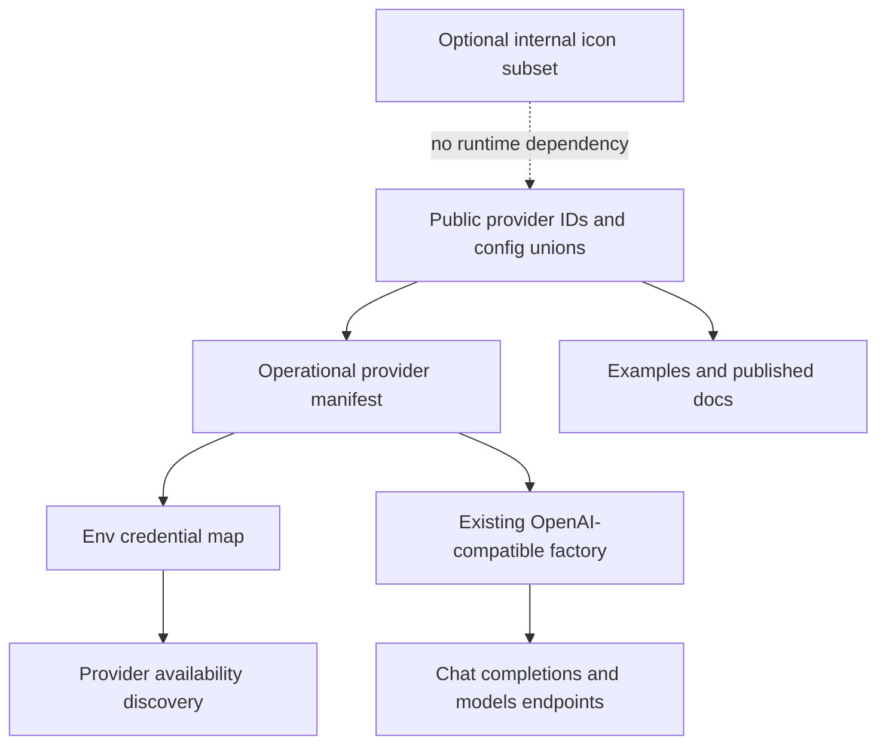

# feat: Add four OpenAI-compatible providers

## Goal Capsule

- **Objective:** Add first-class Groq, Mistral, DeepSeek, and DeepInfra support through the existing OpenAI-compatible runtime without adding provider-specific transports or UI metadata.
- **Authority:** The user's named four-provider batch, followed by the current runtime manifest and public API contracts.
- **Execution profile:** One atomic provider batch because all four share the same transport, auth, model-list, credential, discovery, and documentation seams.
- **Stop conditions:** Any provider requires a custom protocol, non-bearer authentication, or a provider-specific exception beyond declarative runtime metadata.
- **Tail ownership:** LFG implements, verifies, reviews, ships one pull request, and drives CI to a decided green state.

---

## Product Contract

### Summary

BYOK Runtime will recognize `groq`, `mistral`, `deepseek`, and `deepinfra` as cloud providers. Each provider will accept a direct API key or its standard environment variable, list models through the OpenAI-compatible `/models` contract, and generate text or JSON-like objects through the existing chat-completions runtime.

### Problem Frame

AIChat already treats these four services as named OpenAI-compatible providers, while BYOK Runtime's transport already supports the exact request and response subset they expose. The missing work is provider inventory, credentials, discovery, public types, tests, and documentation—not new networking code.

### Requirements

- R1. Add stable provider IDs `groq`, `mistral`, `deepseek`, and `deepinfra` to the public enum, provider ID union, ordered inventory, and cloud config types.
- R2. Configure each provider declaratively with bearer authentication, default model normalization, its official base URL, exact diagnostic label/vendor, and one standard API-key environment variable.
- R3. Reuse `OpenAiCompatibleProvider` unchanged for text generation, object generation, connection testing, model listing, rate-limit retries, and provider error normalization.
- R4. Env-backed credential resolution and provider discovery recognize `GROQ_API_KEY`, `MISTRAL_API_KEY`, `DEEPSEEK_API_KEY`, and `DEEPINFRA_API_KEY` without adding duplicated runtime provider maps.
- R5. Public provider IDs and environment-variable maps retain exact literal tuple/map types after the four additions.
- R6. The Node provider smoke example accepts the four provider IDs and classifies them as cloud providers without depending on UI metadata.
- R7. Published README/API documentation lists the new providers, credentials, and capabilities without claiming full OpenAI API parity.
- R8. `provider-icons.ts` remains internal and is not expanded with new UI assets; its type and inventory test allow a valid subset of supported provider IDs while rejecting unknown IDs.
- R9. Add a minor changeset describing the four new provider capabilities.

### Acceptance Examples

- AE1. Given `{ provider: "groq", apiKey, model }`, provider creation sends a bearer-authenticated chat-completions request to `https://api.groq.com/openai/v1` and exposes `Groq` diagnostics.
- AE2. Given env-backed Mistral, DeepSeek, or DeepInfra credentials, the resolver uses only that provider's documented environment variable and returns the supplied key.
- AE3. Given a mocked standard `{ data: [{ id }] }` models response for each provider, `listModels` returns portable `{ id, label }` values.
- AE4. Given discovery input containing any new provider's API-key environment variable, `findAvailableProviders` includes that provider in stable cloud-provider order.
- AE5. Given the public entrypoint type fixture, the provider ID tuple and env-var map include all four new literal entries without widening to generic strings.

### Scope Boundaries

- Do not add streaming, embeddings, reranking, Responses API, provider-specific request fields, pricing, model catalogs, or live-network tests.
- Do not claim complete OpenAI API compatibility; support is limited to BYOK Runtime's existing chat-completions and models subset.
- Do not add fallback environment-variable aliases beyond the four documented standard names.
- Do not add UI labels, form fields, placeholders, provider icons, or other host-application presentation metadata.
- Do not modify the shared OpenAI-compatible transport unless a failing characterization test proves the current subset is insufficient; such a finding is a stop condition rather than permission to widen this batch.

---

## Planning Contract

### Key Technical Decisions

- KTD1. Treat all four providers as ordinary cloud manifest entries using `auth: "bearer"` and `modelNormalization: "default"`.
- KTD2. Use the AIChat aliases and official endpoints: Groq `https://api.groq.com/openai/v1`, Mistral `https://api.mistral.ai/v1`, DeepSeek `https://api.deepseek.com`, and DeepInfra `https://api.deepinfra.com/v1/openai`.
- KTD3. Preserve the manifest as the operational source of truth for credentials and provider IDs; update the existing discovery cloud sequence because it is an intentional availability-priority policy, not transport metadata.
- KTD4. Make the retained icon map partial rather than manufacturing presentation assets. Its test validates that every icon key is a real provider ID, while runtime completeness remains owned by the manifest.
- KTD5. Prove compatibility through provider-factory and OpenAI-compatible transport mocks; no external credentials or live requests are required for deterministic CI.

### High-Level Technical Design

### Assumptions

- The four providers continue to accept the minimal OpenAI chat-completions request BYOK emits: model plus one user message.
- Their model-list endpoints return the standard OpenAI `data[].id` shape; this is verified locally with contract mocks rather than live credentials.
- Provider-specific optional OpenAI fields are irrelevant because BYOK does not send them.

### System-Wide Impact

The public provider enum and discriminated config unions expand additively. Exhaustive downstream switches may receive TypeScript compile errors and must add the new cases, which is expected for a minor provider-capability release. Provider discovery and examples must stay synchronized with the expanded cloud inventory.

### Risks and Mitigations

- **False compatibility confidence:** Limit claims and tests to the exact request/response subset BYOK uses.
- **Inventory drift:** Extend exact ordered-ID, env-map, factory, discovery, public-contract, and type-fixture tests together.
- **Provider-specific model-list quirks:** Mock the documented OpenAI response shape; any real deviation discovered later belongs in a provider-specific normalization follow-up.
- **UI coupling returns:** Make icons explicitly optional and add no presentation assets or metadata.
- **External API changes:** Record official documentation URLs and keep endpoints declarative in one manifest.

### Phased Delivery

#### Phase 1. Add and verify the four-provider batch

Complete U1 through U4 on `feat/openai-compatible-provider-batch`, run the full package gate, commit, push, open one pull request against `main`, and drive CI to a decided green state.

---

## Implementation Units

### U1. Expand the provider inventory and operational manifest

- **Goal:** Add the four public provider identities and their runtime configuration without changing transport behavior.
- **Requirements:** R1, R2, R3, R8; AE1, AE3.
- **Dependencies:** None.
- **Files:** `src/types.ts`, `src/provider-manifest.ts`, `src/provider-icons.ts`, `tests/provider-manifest.test.ts`, `tests/provider-factory.test.ts`, `tests/openai-compatible-provider.test.ts`.
- **Approach:** Add enum/union members and four cloud manifest entries; retain the common factory path; change the icon map to a partial internal record and replace exact icon parity with valid-subset coverage.
- **Execution note:** Strengthen the exact inventory and factory matrices first and observe failures before changing production code.
- **Patterns to follow:** Existing xAI/OpenAI manifest entries, table-driven provider factory tests, exact diagnostic contract tests.
- **Test scenarios:**
  - Covers AE1. Each new ID creates an OpenAI-compatible provider with its exact label, vendor, and base URL.
  - Covers AE3. Each provider accepts a standard model-list response and returns portable model options.
  - The ordered manifest contains all thirteen providers exactly once.
  - Existing icon keys remain valid provider IDs, and absence of a new provider icon does not affect runtime completeness.
- **Verification:** Focused manifest, factory, and OpenAI-compatible tests pass with no new provider transport class.

### U2. Extend credentials and provider discovery

- **Goal:** Make direct and env-backed configuration and availability discovery work for all four providers.
- **Requirements:** R4, R5; AE2, AE4, AE5.
- **Dependencies:** U1.
- **Files:** `src/credentials.ts`, `src/provider-discovery.ts`, `tests/env-credentials.test.ts`, `tests/provider-discovery.test.ts`, `tests/fixtures/main-entrypoint.ts`.
- **Approach:** Let the manifest-derived credential map acquire the new env tuples, extend the deliberate cloud discovery order, and protect exact literal types in the entrypoint fixture.
- **Patterns to follow:** Existing Google alias precedence test, table-driven env resolution, deterministic discovery dependency injection.
- **Test scenarios:**
  - Covers AE2. Each standard environment variable resolves only for its matching provider.
  - Missing credentials produce provider-specific errors naming the expected variable.
  - Covers AE4. Discovery returns each new provider when its env variable is present and omits it otherwise.
  - Covers AE5. Compile-time fixtures preserve exact provider ID and env-var tuple types.
- **Verification:** Env credential, discovery, and source/example typechecks pass.

### U3. Extend public contract examples and smoke configuration

- **Goal:** Ensure package consumers and the maintained smoke CLI can configure every new provider.
- **Requirements:** R1, R5, R6; AE1, AE5.
- **Dependencies:** U1, U2.
- **Files:** `tests/public-contract.test.ts`, `examples/provider-smoke/src/cli.ts`, `tests/provider-smoke-cli.test.ts`, `tests/fixtures/node-entrypoint.ts`.
- **Approach:** Add representative config variants, extend smoke cloud classification, and preserve exact public export boundaries without adding new top-level functions.
- **Patterns to follow:** Existing provider config matrix and smoke CLI parsing tests.
- **Test scenarios:**
  - The public config union accepts direct-key configurations for all four IDs.
  - The smoke CLI routes each new provider through cloud credential handling and rejects local-only URL flags.
  - No new runtime value exports appear beyond the expanded enum and derived maps.
- **Verification:** Public-contract, smoke CLI, and entrypoint fixture checks pass.

### U4. Document and release the provider batch

- **Goal:** Publish accurate capability and credential guidance with release metadata.
- **Requirements:** R7, R9.
- **Dependencies:** U1, U2, U3.
- **Files:** `README.md`, `API.md`, `examples/provider-smoke/README.md`, `.changeset/<generated-name>.md`.
- **Approach:** Extend provider tables, examples, env-var documentation, and smoke-provider lists; state that the providers reuse BYOK's OpenAI-compatible subset; add a minor changeset.
- **Patterns to follow:** Existing provider capability table and Changesets format.
- **Test scenarios:** Documentation examples use public entrypoints and contain all four provider IDs and env names.
- **Verification:** Documentation contract tests, format check, and package-readiness checks pass.

---

## Verification Contract

| Gate | Coverage | Done signal |
|---|---|---|
| Focused Vitest | Manifest, factory, transport, credentials, discovery, public contract, smoke CLI | New provider tests fail before implementation and pass afterward |
| TypeScript checks | Source, examples, literal provider/env tuples | No union gaps or type widening |
| Full `bun run check` | Format, lint, build, all tests, pack, publint, attw | Repository-required package gate passes |
| Diff audit | Runtime reuse and UI boundary | No new transport classes, UI metadata, or icon assets |
| GitHub CI | Package and CodeQL workflows | Pull request reaches a decided green state |

---

## Definition of Done

- Groq, Mistral, DeepSeek, and DeepInfra are first-class public cloud provider IDs.
- Direct and env-backed credentials, model listing, text/object generation, connection testing, error normalization, and provider discovery work through existing runtime paths.
- Exact provider IDs, env variables, endpoints, labels/vendors, and literal types are protected by tests.
- The smoke CLI and published docs include all four providers.
- No custom transport, UI metadata, or new icon asset is added.
- A minor changeset exists and the full local/CI verification contracts pass.

---

## Appendix

### Sources and Research

- AIChat's `src/client/mod.rs` defines the four aliases and base URLs; `src/client/openai_compatible.rs` routes them through bearer-authenticated `/chat/completions` and `/models` behavior.
- Groq API reference: `https://console.groq.com/docs/api-reference` confirms chat completions and model listing under its OpenAI-compatible base URL.
- Mistral API reference and migration guide: `https://docs.mistral.ai/api` and `https://docs.mistral.ai/resources/migration-guides` confirm `/v1/chat/completions`, `/models`, bearer auth, and OpenAI request compatibility.
- DeepSeek API documentation: `https://api-docs.deepseek.com/` and `https://api-docs.deepseek.com/api/list-models/` confirm the OpenAI SDK base URL, bearer auth, chat completions, and standard model-list response.
- DeepInfra quickstart: `https://docs.deepinfra.com/quickstart` confirms bearer-authenticated OpenAI-compatible chat completions at `/v1/openai`.
- Repository patterns: `src/provider-manifest.ts`, `src/providers/provider-factory.ts`, `src/credentials.ts`, `src/provider-discovery.ts`, and their mirrored tests.
