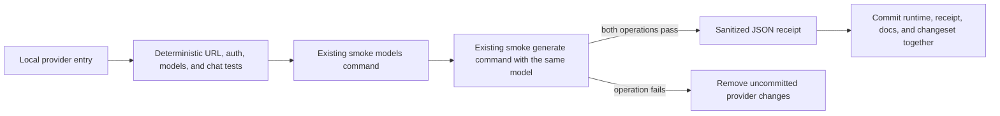
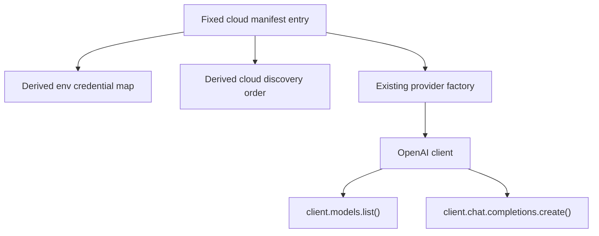

# OpenAI-Compatible Provider Expansion - Plan

## Goal Capsule

- **Objective:** Add eight cloud providers that fit BYOK Runtime's existing fixed-endpoint OpenAI-compatible path for model listing and plain-text generation.
- **Authority:** The confirmed eight-provider scope, then the compatibility and admission rules in this plan, then current repository contracts.
- **Execution profile:** One uniform provider batch using the existing smoke commands. Work through providers sequentially so each support patch can be admitted or dropped independently.
- **Stop conditions:** Stop a provider's addition if it requires a native catalog adapter, provider SDK, custom endpoint, non-bearer authentication, provider-specific request transformation, or public configuration fields or shapes beyond the required provider-ID and config-union members.
- **Tail ownership:** The executor owns deterministic tests, one live admission per provider, sanitized receipts, documentation, a minor changeset, review, and CI.

---

## Product Contract

### Summary

BYOK Runtime will add Together AI, Cerebras, SambaNova Cloud, Novita AI, MiniMax, Hugging Face Inference Providers, Nebius Token Factory, and Scaleway Generative APIs. Each provider will reuse the installed OpenAI SDK for both `models.list()` and `chat.completions.create()` against one fixed base URL and bearer credential. Public support requires deterministic contract coverage and one dated live admission receipt.

### Problem Frame

BYOK Runtime already routes cloud providers through one OpenAI-compatible runtime. The missing work is provider identity, manifest metadata, credentials, discovery, contract tests, smoke admission, and documentation. The expansion should not introduce endpoint strategies, catalog adapters, model filters, or a provider lifecycle system.

### Actors

- A1. **Library consumer:** Supplies a supported provider credential, lists model IDs, and generates text with a selected ID.
- A2. **Maintainer:** Adds one uniform provider definition, verifies its exact SDK contracts, and runs live admission before committing the support claim.

### Requirements

#### Provider support

- R1. Add stable public IDs `together`, `cerebras`, `sambanova`, `novita`, `minimax`, `huggingface`, `nebius`, and `scaleway`.
- R2. Configure every new provider as a fixed-base-URL, bearer-authenticated manifest entry with standard model normalization and one standard API-key environment variable.
- R3. Reuse `OpenAiCompatibleProvider` unchanged for OpenAI SDK model listing and chat-completions generation.
- R4. Define compatibility only as successful `models.list()` and `chat.completions.create()` calls against the same credential and provider surface.
- R5. Preserve `listModels()` as a neutral catalog; support does not imply that every returned model can generate chat text.

#### Admission and release

- R6. Admit a provider by running the existing credentialed `provider-smoke models` command, confirming a caller-supplied public chat model ID is present, and then running the existing `provider-smoke generate` command with that exact ID.
- R7. Check in a small, manually reviewed JSON receipt only after both existing commands pass.
- R8. A receipt contains provider ID, fixed base URL, UTC verification time, package version, OpenAI SDK version, selected model ID, returned model count, and pass results for both operations.
- R9. Receipts never contain credentials, headers, prompts, completions, full model catalogs, account IDs, raw command output, or raw provider response bodies. Live admission runs with OpenAI SDK debug logging disabled and raw output is not redirected into repository files.
- R10. Add a provider to public runtime and documentation surfaces only in the same commit as its passing receipt.
- R11. Derive cloud discovery order from the ordered manifest instead of extending the duplicated `CLOUD_PROVIDERS` tuple.
- R12. Document the exact two-operation compatibility subset, provider credentials, and excluded endpoint lanes.
- R13. Add one minor changeset for the admitted provider batch.

### Provider Portfolio

| Public ID | Supported service lane | OpenAI SDK base URL | Standard key variable | Boundary |
|---|---|---|---|---|
| `together` | Together serverless API | `https://api.together.ai/v1` | `TOGETHER_API_KEY` | Use a current public chat model. |
| `cerebras` | Current Cerebras inference API | `https://api.cerebras.ai/v1` | `CEREBRAS_API_KEY` | Verify current post-July-2026 behavior. |
| `sambanova` | Hosted SambaNova Cloud | `https://api.sambanova.ai/v1` | `SAMBANOVA_API_KEY` | Exclude custom SambaStack URLs. |
| `novita` | Novita OpenAI-compatible API | `https://api.novita.ai/openai/v1` | `NOVITA_API_KEY` | Ignore extra model metadata. |
| `minimax` | MiniMax global service | `https://api.minimax.io/v1` | `MINIMAX_API_KEY` | Exclude the mainland-China service. |
| `huggingface` | Hugging Face Inference Providers router | `https://router.huggingface.co/v1` | `HF_TOKEN` | Preserve provider-routing suffixes in IDs. |
| `nebius` | Nebius Token Factory | `https://api.tokenfactory.nebius.com/v1` | `NEBIUS_API_KEY` | Exclude retired AI Studio credentials. |
| `scaleway` | Scaleway Serverless Generative APIs | `https://api.scaleway.ai/v1` | `SCW_SECRET_KEY` | Exclude dedicated and project-specific URLs. |

### Flows

- F1. **Atomic provider admission:** Implement one provider in an isolated patch → pass deterministic contracts → run the two existing smoke commands → commit the provider surfaces, receipt, docs, and changeset update together. Remove only that provider's uncommitted changes if admission fails.
- F2. **Consumer use:** Configure a supported credential → list models → select a returned model ID → generate text with that ID.

### Acceptance Examples

- AE1. Given a new provider with a mocked standard model list, `listModels()` returns portable `{ id, label }` values from the provider's exact fixed base URL.
- AE2. Given a supplied admission model that is absent from the returned catalog, the maintainer does not run generation and checks in no receipt.
- AE3. Given a supplied admission model that appears in the catalog and returns nonblank assistant text, the maintainer records only the allowlisted receipt fields.
- AE4. Given failed admission or verbose provider output, no credential, prompt, completion, full catalog, account identifier, header, or raw response is added to the repository.
- AE5. Given one unavailable provider credential, the other admitted providers can ship while that provider stays out of public runtime and documentation surfaces.

### Success Criteria

- The plan is complete when all eight providers have deterministic SDK contract coverage and passing live receipts. Independently admitted subsets may ship as intermediate releases, but do not satisfy this plan's eight-provider objective.
- The public provider inventory grows from 13 to 21 unique providers in stable family order.
- Discovery, credential maps, smoke help, public types, and documentation remain synchronized.
- No new provider transport, catalog adapter, model filter, endpoint strategy, or public config field is introduced.
- `bun run check` and CI pass.

### Scope Boundaries

- Defer AWS Bedrock Mantle because its region-derived endpoint requires provider-specific configuration and factory behavior.
- Defer SiliconFlow, NVIDIA API Catalog, and Vercel AI Gateway because their mixed-modality catalogs add admission and support ambiguity.
- Defer Fireworks AI and Cloudflare Workers AI because model listing needs catalog adapters.
- Do not add GitHub Models; the service retired on July 30, 2026.
- Do not add self-hosted, dedicated, project-specific, regional-alternative, or arbitrary provider endpoints.
- Do not add pagination, catalog filtering, pricing, context windows, recommendations, or hard-coded default models.
- Do not certify streaming, embeddings, Responses API, structured objects, tool calls, or full OpenAI API parity.
- Do not create candidate/degraded/retired runtime states or a general compatibility ledger.
- Do not backfill live receipts for the existing 13 providers in this batch.
- Do not run secret-bearing live admission in ordinary pull-request CI.

### Dependencies

- A maintainer must provide a valid low-privilege credential and one current, public, chat-capable model ID for each provider.
- Provider accounts must have access to the selected model and models endpoint.

### Sources

- Upstream ideation: `docs/ideation/2026-07-16-openai-compatible-provider-expansion-ideation.html`.
- Existing runtime: `src/provider-manifest.ts`, `src/providers/openai-compatible-provider.ts`, `src/providers/provider-factory.ts`, `src/credentials.ts`, and `src/provider-discovery.ts`.
- Existing smoke surface: `examples/provider-smoke/src/cli.ts` and `examples/provider-smoke/README.md`.
- Closest repository precedent: commits `db22bec`, `b68361a`, and `c2d4dee`.

---

## Planning Contract

### Key Technical Decisions

- KTD1. Add only the eight providers listed in R1. (session-settled: user-approved — chosen over the 12-provider scope: AWS requires special configuration, while SiliconFlow, NVIDIA, and Vercel add mixed-catalog ambiguity.)
- KTD2. Keep the compatibility claim operation-specific: OpenAI SDK model listing plus chat-completions text generation. This decision governs R3-R5 and R12.
- KTD3. Keep every new provider on the existing fixed-URL, bearer-authenticated manifest path. A provider-specific exception is a stop condition, not permission to widen the batch.
- KTD4. Use the existing `provider-smoke models` and `provider-smoke generate` commands plus checked-in JSON receipts instead of adding a verification command, compatibility ledger, or runtime lifecycle state.
- KTD5. Process providers sequentially. Keep the current provider's changes isolated until deterministic checks and live admission pass, then commit its public surfaces and receipt before starting the next provider. If admission fails, discard only that provider's uncommitted patch.
- KTD6. Preserve unfiltered model catalogs. Verification accepts a maintainer-supplied public chat model, requires exact membership, and generates with the same ID.
- KTD7. Derive cloud discovery order from the cloud entries in `BYOK_PROVIDER_MANIFEST`. Keep credentials, registry IDs, discovery, and smoke choices manifest-driven.
- KTD8. Apply receipt enforcement only to the frozen eight-ID expansion set. Existing providers remain supported under their current evidence because backfilling 13 receipts is outside R1-R13.

### High-Level Technical Design

### Implementation Constraints

- Keep the main entrypoint free of Node-only process APIs and secret persistence.
- Continue to inject `fetch` for deterministic tests.
- Keep SDK retries disabled in `OpenAiCompatibleProvider`.
- Use a synthetic low-cost prompt and never persist the prompt or completion.
- Disable OpenAI SDK debug logging during live admission and never persist raw command output.
- Keep public examples on `@swartzrock/byok-runtime` and `@swartzrock/byok-runtime/node`.

### System-Wide Impact

The provider enum, config union, ordered provider tuple, environment-key maps, discovery results, smoke help, package documentation, and downstream exhaustive switches all expand. The repository gains eight sanitized evidence files. Runtime architecture and public configuration shapes do not change beyond the required provider-ID and config-union members.

### Risks and Mitigations

- **Documentation can overstate compatibility:** Require deterministic tests and a live receipt before committing support.
- **Provider catalogs change:** Record the verification date and tested model without creating a default model.
- **A listed model may not support chat:** Require exact membership and successful generation with a maintainer-supplied public chat ID.
- **Credentials or content can leak through saved output:** Keep live output terminal-only, disable SDK debug logging, and author receipts from an allowlist rather than copying command output.
- **A receipt can be hand-authored:** Treat it as a maintainer attestation rather than cryptographic proof; require review or rerun before release.
- **Credentials are unavailable:** Admit providers independently and keep unverified providers out of public surfaces.
- **Operational lists drift:** Derive operational data from the manifest and retain exact public-contract tests.

### Delivery Sequence

1. Complete U1 to document the existing-command admission procedure and receipt shape.
2. Complete U2 to remove cloud discovery duplication for the existing manifest.
3. Complete U3 to add and admit the eight providers sequentially, including documentation and release metadata.

---

## Implementation Units

### U1. Document minimal live admission

- **Goal:** Define a small, repeatable admission procedure without adding runtime or smoke CLI machinery.
- **Requirements:** R4, R6-R10; AE2-AE4.
- **Dependencies:** None.
- **Files:** `examples/provider-smoke/README.md`, `docs/provider-admission/receipt-template.json`.
- **Approach:** Document how to run the existing `models` command, confirm an explicit public chat model ID, and run the existing `generate` command with that ID. Add an allowlisted receipt template. The maintainer authors the receipt after reviewing the terminal-only results; the receipt is an attestation, not machine-generated proof.
- **Test scenarios:**
  - Covers AE2. The procedure stops when the exact model ID is absent.
  - Covers AE3. The template includes only the receipt fields listed in R8.
  - Covers AE4. The procedure disables SDK debug logging, keeps raw output out of files, and requires manual secret review before commit.
  - Empty catalogs, blank text, authentication errors, rate limits, network failures, and timeouts produce no receipt.
- **Verification:** Review the documented steps against the existing smoke CLI help and confirm the receipt template contains exactly the R8 fields.

### U2. Keep operational provider inventory manifest-driven

- **Goal:** Remove the existing duplicated cloud-provider list before expanding the manifest.
- **Requirements:** R11.
- **Dependencies:** None.
- **Files:** `src/provider-manifest.ts`, `src/provider-discovery.ts`, `tests/provider-discovery.test.ts`.
- **Approach:** Derive cloud discovery order from the repository's existing ordered cloud manifest entries and remove `CLOUD_PROVIDERS`. Do not add the eight new entries in this unit.
- **Test scenarios:**
  - Discovery preserves local, CLI, then ordered cloud fallback behavior.
  - The derived cloud list exactly matches the pre-change public cloud order.
  - Local and CLI providers remain outside the cloud-manifest derivation.
- **Verification:** Focused discovery tests pass without changing the public provider inventory.

### U3. Add and admit the eight-provider batch

- **Goal:** Promote the eight uniform providers through existing runtime and public API paths.
- **Requirements:** R1-R13; AE1-AE5.
- **Dependencies:** U1, U2.
- **Files:** `src/types.ts`, `src/provider-manifest.ts`, `src/providers/provider-factory.ts`, `src/credentials.ts`, `src/provider-discovery.ts`, `tests/provider-manifest.test.ts`, `tests/provider-factory.test.ts`, `tests/env-credentials.test.ts`, `tests/provider-discovery.test.ts`, `tests/public-contract.test.ts`, `tests/fixtures/main-entrypoint.ts`, `tests/provider-smoke-cli.test.ts`, `docs/provider-admission/receipts/`, `README.md`, `API.md`, `examples/provider-smoke/README.md`, `.changeset/<generated-name>.md`.
- **Approach:** Add enum and union members plus eight fixed bearer manifest entries. Extend table-driven URL, header, model normalization, credential, discovery, public-contract, and type-fixture tests. Process one provider at a time: isolate its patch, pass deterministic checks, run the two existing smoke commands with one current documented public chat model, add the reviewed receipt and documentation, then commit before starting the next provider. If admission fails, discard only that provider's uncommitted patch. Intermediate releases may contain an admitted subset, but this unit completes only after all eight providers pass.
- **Test scenarios:**
  - Every provider constructs the exact base URL in the Provider Portfolio and sends bearer auth.
  - Every standard env variable resolves only for its matching provider and appears in exact exported maps.
  - Model rows with extra provider fields still normalize to `{ id, label }`.
  - Every promoted provider's receipt attests to exact model membership and nonblank generation.
  - An unavailable or failed provider remains absent from public IDs, docs, and changeset copy.
- **Documentation and release scenarios:**
  - Public docs contain every promoted provider and no failed or unavailable provider.
  - Docs do not claim structured output, full OpenAI parity, arbitrary endpoints, or universal chat support for every listed model.
  - Every promoted provider maps to credential guidance and one receipt.
  - The admitted batch has a minor changeset.
- **Verification:** Focused provider, credential, discovery, public-contract, fixture, and smoke tests pass. Every promoted provider has a current reviewed receipt, accurate documentation, and release metadata.

---

## Verification Contract

| Gate | Coverage | Done signal |
|---|---|---|
| Admission procedure | `examples/provider-smoke/README.md`, `docs/provider-admission/receipt-template.json` | Existing model-list and generation commands are documented; the receipt template contains only the R8 fields. |
| Provider contracts | `tests/provider-manifest.test.ts`, `tests/provider-factory.test.ts`, `tests/openai-compatible-provider.test.ts` | Exact URLs, bearer auth, SDK model listing, chat generation, and normalization pass. |
| Credentials and discovery | `tests/env-credentials.test.ts`, `tests/provider-discovery.test.ts` | Env maps and manifest-derived provider ordering pass. |
| Public API | `tests/public-contract.test.ts`, `tests/fixtures/main-entrypoint.ts` | Exact provider tuple and config types remain narrow and documented. |
| Live admission | Existing `provider-smoke models` and `provider-smoke generate` commands | The exact returned model generates nonblank text; a maintainer then authors and reviews the sanitized receipt. |
| Full package gate | `bun run check` | Format, lint, build, typechecks, tests, package contents, publint, and attw pass. |
| Scope audit | Final diff and documentation review | No adapter, special endpoint, provider SDK, custom config, hard-coded model, secret, or expanded capability claim enters the batch. |

Live admission remains outside ordinary pull-request CI. Mocks alone do not qualify a provider for public support.

---

## Definition of Done

- Every shipped provider is one of the eight IDs in R1.
- Every shipped provider uses the unchanged fixed-URL, bearer-authenticated `OpenAiCompatibleProvider` path for both required SDK operations.
- Every shipped provider has exact deterministic coverage and a reviewed live receipt.
- Public types, manifest, credentials, discovery, smoke CLI, docs, and changeset contain only admitted providers.
- No provider-specific transport, endpoint strategy, catalog filter, lifecycle system, or public configuration beyond the required provider-ID and config-union members is added.
- `bun run check` and GitHub CI pass.
- Temporary credentials, raw provider output, failed candidate code, and abandoned admission experiments are absent from the final diff.

---

## Appendix

### Official implementation references

- Together: `https://docs.together.ai/docs/inference/openai-compatibility`.
- Cerebras: `https://inference-docs.cerebras.ai/resources/openai` and `https://inference-docs.cerebras.ai/api-reference/models/list-models`.
- SambaNova: `https://docs.sambanova.ai/docs/en/features/openai-compatibility` and `https://docs-prod.sambanova.ai/docs/api-reference/endpoints/model-list`.
- Novita: `https://novita.ai/docs/api-reference/model-apis-introduction`.
- MiniMax: `https://platform.minimax.io/docs/api-reference/text-openai-api` and `https://platform.minimax.io/docs/api-reference/models/openai/list-models`.
- Hugging Face: `https://huggingface.co/docs/inference-providers/tasks/chat-completion` and `https://huggingface.co/docs/inference-providers/en/hub-api`.
- Nebius: `https://docs.tokenfactory.nebius.com/api-reference/examples/list-of-models`.
- Scaleway: `https://www.scaleway.com/en/docs/generative-apis/reference-content/openai-compatibility/`.

### Research notes

- No `CONCEPTS.md` or `solutions/` learning corpus exists in this repository.
- The prior four-provider batch needed a review correction for an inaccurate DeepInfra credential assumption. Exact credential documentation and live admission therefore remain release evidence.
- Model IDs remain dated admission evidence, not runtime defaults.
