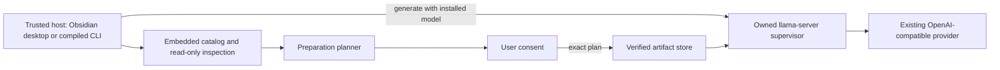

# Built-in Local LLMs - Plan

## Goal Capsule

Add an opt-in, Node-only managed-local provider to `byok-runtime`. A trusted host can inspect a curated model catalog, show the user an exact preparation cost, download verified model and runtime artifacts after approval, and run the selected model through an owned `llama-server` process. The npm package remains small because it embeds only metadata.

The Product Contract owns observable behavior. The Planning Contract owns implementation mechanisms. Implementation units must cite both and must not expand browser, external-model-store, or cross-platform runtime scope.

This is a Deep plan. Execute U1 through U8 in dependency order. U1 must establish a Gatekeeper-compatible macOS runtime distribution before public API work proceeds. Stop and surface a blocker if neither the pinned upstream archive nor a byok-runtime-signed and notarized build can run on a clean macOS arm64 host. The implementation tail owns tests, a changeset, documentation, a release-ready branch, and the repository's normal PR workflow.

## Product Contract

### Summary

`byok-runtime` will offer a built-in local inference option without bundling model weights or a native runtime in the npm package. The initial release will support Apple Silicon macOS hosts running trusted Node-capable code, including an Obsidian desktop plugin and a Bun-compiled TypeScript CLI. Users will choose from a small curated catalog and approve a concrete download plan before any bytes are fetched.

### Problem Frame

Ollama and LM Studio already let `byok-runtime` use local models, but they require separate applications and installation flows. A built-in path should remove that dependency while preserving user control over multi-gigabyte downloads, filesystem use, executable installation, and process lifetime. The solution must also keep the portable package entry point free of Node filesystem and child-process dependencies.

### Actors

- A1. The end user chooses a model, approves storage and transfer cost, observes progress, and can remove managed artifacts.
- A2. A trusted host integration presents consent and calls the mutating lifecycle APIs. Initial hosts are an Obsidian desktop plugin and a Bun-compiled TypeScript CLI.
- A3. An automation or agent may inspect catalog and installation state, but it does not receive direct authority to prepare or remove artifacts unless the trusted host grants that authority outside this library.

### Product Key Decisions

- Built-in local inference is a trusted Node-host feature on macOS arm64 (session-settled: user-directed — chosen over browser execution and simultaneous three-platform support: the initial hosts are Obsidian desktop and a compiled macOS CLI). Governs R1, R15, R16, and R17.
- Preparation is always explicit (session-settled: user-directed — chosen over bundled weights, install-time downloads, and first-generation downloads: the caller must be able to show and approve the extra size). Governs R3, R4, R8, and R9.
- The first catalog contains only public GGUF files published by the model author (session-settled: user-approved — chosen over community quantizations and arbitrary URLs: immutable provenance and integrity are more important than breadth in v1). Governs R5 and R18.
- Managed artifacts use a byok-runtime-owned shared support directory with a host override (session-settled: user-approved — chosen over package-local, vault-local, and Electron `userData` storage: large artifacts must survive package updates and remain available to both hosts). Governs R6, R7, R13, and R14.
- Ollama and LM Studio remain separate providers and stores (session-settled: user-approved — chosen over import, adoption, or deduplication: v1 must not depend on undocumented external layouts or mutate another application's data). Governs R14 and R18.

### Requirements

#### Catalog and consent

- R1. The Node entry point exposes a managed-local provider and a rich downloadable-model catalog; importing or inspecting either performs no network request, filesystem write, or process launch.
- R2. The existing provider `listModels()` contract returns only installed and verified managed models as `{ id, label }` options.
- R3. Preparation inspection returns an immutable plan with artifact identities, sources, transfer bytes, installed bytes, temporary bytes, required free bytes, compatibility, and a fingerprint.
- R4. The trusted host authorizes preparation by submitting the exact inspected plan; a stale plan performs no mutation and returns a typed result that requires fresh inspection and approval.

#### Artifact integrity and storage

- R5. Each catalog artifact is pinned by an immutable source revision, exact filename, exact byte count, SHA-256 digest, license, and compatible runtime profile.
- R6. The runtime stores models, the complete native runtime bundle, receipts, temporary files, locks, and usage leases under a private versioned support root outside the npm package and Obsidian vault.
- R7. The default macOS root is under `~/Library/Application Support/byok-runtime`; every Node lifecycle factory accepts an explicit root override.
- R8. Preparation streams progress through stable phases, supports `AbortSignal`, enforces the approved byte ceiling, and never publishes partial or unverified data as installed.

#### Local inference

- R9. Generation may start a verified installed runtime, but it never downloads, repairs, updates, or removes an artifact.
- R10. The managed runtime binds only to loopback, requires a per-instance secret, disables unrelated server features, and proves authenticated model identity before accepting traffic.
- R11. A provider instance owns and reuses one sidecar for its selected model; explicit disposal and normal host shutdown stop only processes created by that instance.
- R12. `generateText` and the existing structured-output pathway preserve separate instructions and user prompts; the initial Qwen profiles use a deterministic non-thinking mode and a conservative tested context size.

#### State, concurrency, and removal

- R13. Cross-process artifact locks and usage leases make concurrent Obsidian and CLI operations safe; a waiter adopts a verified result instead of downloading the same artifact twice.
- R14. Removal is explicit, idempotent, and inspectable; it rejects in-use artifacts, reports reclaimed bytes, removes only the selected model revision, and prunes unused runtime revisions only through a separate action.
- R15. Read-only state and typed errors distinguish unsupported, not installed, partial, corrupt, preparing, in use, ready, stale plan, insufficient disk, integrity failure, cancellation, runtime blocked, startup failure, and runtime crash.

#### Host integration and compatibility

- R16. The embedded catalog and Node API work when bundled in an Obsidian desktop-only plugin and when compiled into a single macOS arm64 executable with the repository's Bun toolchain.
- R17. Windows, Linux, and macOS x64 may inspect the catalog and receive structured incompatibility reasons, but v1 preparation and generation fail before writes or launches on those hosts.
- R18. V1 accepts no caller-supplied model URL or arbitrary GGUF path and does not inspect, import, remove, or deduplicate Ollama or LM Studio artifacts.
- R19. Public documentation discloses download sources, exact and approximate sizes, licenses, executable installation, external storage, lifecycle controls, network use, and Obsidian desktop-only requirements.
- R20. A package/catalog upgrade preserves recognition, operation, and removal metadata for artifacts installed by supported prior catalog versions; it never retargets an existing artifact ID to new bytes.

### Key Flows

- F1. Inspect and prepare: A2 lists the embedded catalog, inspects compatibility and exact cost, obtains A1's consent, submits the unchanged plan, streams progress, and receives either `ready` or one typed terminal failure.
- F2. Generate: A2 selects an installed model, the provider starts or reuses its owned sidecar, validates readiness and model identity, delegates generation through the existing OpenAI-compatible provider, and later disposes the sidecar.
- F3. Remove: A2 inspects model and optional runtime reclamation, obtains A1's confirmation, acquires exclusive locks, rejects in-use artifacts, and reports actual reclaimed bytes.
- F4. Coordinate hosts: two host processes may inspect concurrently; mutating operations serialize per artifact, re-inspect after lock acquisition, and never share or discover each other's sidecar process.

### Acceptance Examples

- AE1. Covers R1. Given no managed support directory exists, importing `@swartzrock/byok-runtime/node` and listing the catalog leaves the filesystem unchanged, makes no request, and starts no child.
- AE2. Covers R3 and R5. Given no runtime or model is installed, preparation inspection includes both pinned artifacts and reports exact transfer, final, temporary, and peak free-space bytes without network access.
- AE3. Covers R3. Given the runtime is already verified, inspecting a second model reports zero runtime transfer bytes and includes only missing model and operation overhead.
- AE4. Covers R4. Given the host approved fingerprint A, if the catalog or installed state changes before `prepare(A)`, preparation returns `stale-plan`, performs no download, and supplies a new inspectable plan.
- AE5. Covers R5 and R8. Given downloaded bytes match the expected size and digest, committing makes the final artifact and receipt visible atomically; a mismatch leaves no ready artifact.
- AE6. Covers R8. Given an active transfer, cancellation emits exactly one cancelled terminal event, deletes only operation-owned staging data, releases locks, and requires a later explicit preparation to restart.
- AE7. Covers R9. Given a configured model is absent or corrupt, generation returns a typed remediation error without network, filesystem mutation, or sidecar startup.
- AE8. Covers R10 through R12. Given a verified model, first generation starts a loopback-only authenticated sidecar, waits for authenticated expected-model readiness, preserves instructions and prompt, and later calls reuse that process.
- AE9. Covers R13. Given Obsidian and a CLI prepare the same artifact concurrently, one downloads while the cancellable waiter re-inspects and returns ready after the first commits.
- AE10. Covers R14. Given a sidecar holds a usage lease, removal from another process returns `busy` and neither signals the process nor changes the artifact.
- AE11. Covers R14. Removing an absent model succeeds with zero reclaimed bytes; removing a present model excludes retained shared-runtime bytes; explicit pruning reports those bytes separately.
- AE12. Covers R16. A Bun-compiled executable lists the embedded catalog without resolving files from `node_modules`, then uses a prepared model through the same public Node API as the Obsidian host.
- AE13. Covers R17. On Windows, Linux, or macOS x64, catalog inspection reports `unsupported`; preparation and generation fail before creating the default root.
- AE14. Covers R20. If a catalog update recommends a new revision, an installed old revision stays identifiable and usable until the user explicitly replaces or removes it.

### Success Criteria

- Catalog and preparation inspection have zero observable mutation and zero network traffic in automated tests.
- Every successful installation is byte-count and SHA-256 verified before atomic publication.
- Concurrent preparation performs at most one transfer per artifact and removal cannot race an active sidecar.
- The public release passes a quarantined clean-machine macOS arm64 runtime smoke, an Obsidian desktop smoke, and a Bun-compiled executable smoke.
- Normal disposal, Obsidian unload, and handled CLI termination leave no listener or child process.
- The packed npm artifact contains no model, runtime archive, GGUF, or package-relative catalog asset.

### Scope Boundaries

In scope:

- One managed-local provider for macOS arm64.
- Three official Qwen GGUF choices: small, recommended, and higher-quality.
- A pinned `llama-server` runtime, verified acquisition, lifecycle management, safe removal, and host integration guidance.
- Future-compatible catalog metadata and structured unsupported results on other operating systems.

Deferred:

- Windows, Linux, macOS x64, browser, mobile, and sandboxed App Store hosts.
- Arbitrary local GGUF files, caller-supplied URLs, gated/authenticated models, community quantizations, and remote catalog updates.
- Resumable downloads; explicit retries restart the missing artifact within a newly approved plan.
- Sidecar sharing across processes, background daemons, automatic updates, and automatic model/runtime pruning.
- Ollama or LM Studio import, storage inspection, migration, and deduplication.
- Native embeddings, tools, media, speculative decoding, and multi-model routing.

### Dependencies

- Public official Qwen Hugging Face repositories must continue to provide the pinned immutable files.
- A pinned llama.cpp build must pass the runtime compatibility suite.
- If an upstream archive is blocked by Gatekeeper, the project needs Apple Developer ID signing and notarization credentials plus a release-asset publishing location.
- Obsidian host integrations must declare `isDesktopOnly`, present consent, disclose external access, and call disposal on unload.

### Deferred Questions

These questions do not block v1:

- Which Windows and Linux runtime assets and accelerators should be supported first?
- Should a later release import arbitrary user-owned GGUF files without managing their lifecycle?
- Should interrupted downloads resume after a new approval instead of restarting?
- Should compatible host processes share a single authenticated daemon to reduce duplicate RAM use?

## Planning Contract

### Key Technical Decisions

- KTD1. Add provider ID `managed-local` with label `Built-in Local`, but export its lifecycle manager only from `src/node.ts`. The portable function-first client remains unchanged because it creates short-lived providers and cannot own a child process. This implements R1, R9, R11, and R16.
- KTD2. Keep `ByokModelOption` exactly `{ id, label }`. Add a Node-only rich catalog surface for downloadable metadata and state; use `listModels()` only for verified installed choices. This implements R1 and R2 and preserves the public contract asserted in `tests/public-contract.test.ts`.
- KTD3. Embed a versioned immutable artifact manifest in TypeScript so compiled executables need no package-relative JSON. Artifact IDs never change meaning; legacy records may become hidden recommendations but remain resolvable. This implements R5, R16, and R20.
- KTD4. Use a two-phase inspect/execute contract. The preparation plan fingerprint binds catalog version, artifact IDs, revisions, digests, byte ceilings, installed-state snapshot, platform, and storage root. `prepare` rechecks after locks are acquired. It returns adopted readiness when another process has fulfilled the exact submitted artifacts, and rejects other drift as `stale-plan`. Calling `prepare` is the mutation authority; no `allowDownload` boolean weakens that boundary. This implements R3, R4, and R8.
- KTD5. Provide a macOS default-root helper and accept an override on every manager factory (session-settled: user-approved — chosen over vault/package-local storage and mandatory caller configuration: Obsidian and CLI should share downloads while hosts retain policy control). Store complete runtime bundles, models, receipts, locks, leases, and unique staging paths beneath versioned subdirectories. This implements R6 and R7.
- KTD6. Stream catalog-owned HTTPS downloads to same-filesystem staging with an approved byte ceiling and SHA-256. Accept only HTTPS redirects, redact redirected URLs, and verify the final bytes against the immutable catalog record. Retry only transient transport and 429/5xx failures within the original byte ceiling. Never retry integrity failures automatically. Validate archives against traversal and escaping links, then atomically rename after verification. This implements R5 and R8.
- KTD7. Treat the llama.cpp distribution as a tested supply-chain artifact. Prefer the pinned official full release bundle only if a quarantined clean-host check passes. Otherwise build the same pinned official commit reproducibly and distribute a byok-runtime-owned Developer-ID-signed and notarized archive; never clear quarantine programmatically. This implements R5, R10, and R16.
- KTD8. Launch the verified absolute `llama-server` with `shell: false`, an argument array, a sanitized environment, loopback binding, random non-reused port, stable model alias, conservative context, offline mode, and disabled Web UI and unrelated features. Place its API-key file in an operation-private directory with mode 0600, and delete that file after authenticated readiness or terminal startup failure. Poll health for load state, then require authenticated `/v1/models` to return the expected alias. This implements R10 and R12.
- KTD9. Build a long-lived supervisor with injected spawn and HTTP seams instead of reusing `LocalCommandRunner`. It coalesces concurrent in-process starts, continuously drains bounded redacted output, settles startup once, maps early close and crashes to typed errors, and uses SIGTERM followed by bounded SIGKILL during idempotent disposal. This implements R11 and R15.
- KTD10. Use per-artifact interprocess locks plus model/runtime usage leases. Prepare and remove are mutually exclusive for the same artifact. Different model downloads may proceed concurrently. Sidecars are never adopted across host processes. The store defends against crashes and accidental same-user concurrency; it does not claim isolation from another malicious process running as the same OS user. This implements R13 and R14.
- KTD11. Derive durable state from verified receipts and on-disk artifacts. A receipt records manifest version, immutable artifact ID, revision, size, digest, and installed path. Temporary state is never enough to report ready. This implements R5, R15, and R20.
- KTD12. Retain the package's current Node 20 compatibility floor for this feature and use APIs available there; add active Node 22 and 24 coverage for maintained-runtime confidence. Raising the package-wide engine is a separate semver decision, even though Node 20 is now EOL. This implements R16 without expanding scope.
- KTD13. Document inspection as safe for agent/tool exposure and mutation as a trusted-host approval boundary. The library does not prompt users itself and must not present `prepare`, removal, or prune as unguarded agent tools. This implements R4 and the A2/A3 authority split.

### Initial Artifact Manifest

The implementation must copy these exact records into the embedded catalog and verify them against their official sources before merge.

| Catalog choice | Immutable source | File | Bytes | SHA-256 | Profile |
|---|---|---:|---:|---|---|
| Small | `Qwen/Qwen3-0.6B-GGUF@23749fefcc72300e3a2ad315e1317431b06b590a` | `Qwen3-0.6B-Q8_0.gguf` | 639,446,688 | `9465e63a22add5354d9bb4b99e90117043c7124007664907259bd16d043bb031` | Lowest disk/RAM option |
| Recommended | `Qwen/Qwen3-1.7B-GGUF@90862c4b9d2787eaed51d12237eafdfe7c5f6077` | `Qwen3-1.7B-Q8_0.gguf` | 1,834,426,016 | `061b54daade076b5d3362dac252678d17da8c68f07560be70818cace6590cb1a` | Default balance |
| Quality | `Qwen/Qwen3-4B-GGUF@bc640142c66e1fdd12af0bd68f40445458f3869b` | `Qwen3-4B-Q4_K_M.gguf` | 2,497,280,256 | `7485fe6f11af29433bc51cab58009521f205840f5b4ae3a32fa7f92e8534fdf5` | Higher-quality option |

All three model records use Apache-2.0, non-thinking mode, and an 8,192-token default context. Advertised model maximum context remains metadata and does not become the launch default.

The initial runtime candidate is llama.cpp `b10369` at commit `6e62ba538478202094edc6c100c782719e310aa3`. The arm64 release asset is `llama-b10369-bin-macos-arm64.tar.gz`, 11,069,404 bytes, SHA-256 `de2ac2c0a7cc245bce2411393658ff19c9c00d9d1fe37c5dfe94668c0d7bc01f`. U1 may replace the distribution URL and archive digest with the signed/notarized fallback, but must retain the pinned upstream source commit and record both identities.

### High-Level Technical Design

The installed artifact lifecycle is `not-installed -> preparing -> verifying -> committing -> ready`. Failure or cancellation returns to the previous verified state or `not-installed`. Read-only inspection may additionally report `partial`, `corrupt`, `in-use`, and `unsupported`.

The sidecar lifecycle is `stopped -> starting -> loading -> ready -> stopping -> stopped`. Startup races child errors, early close, cancellation, port-collision retries, and a deadline. Only authenticated expected-alias readiness enters `ready`.

### System-Wide Impact

- Public API: `ByokProvider`, provider config unions, the manifest, registry, Node factory, and Node entry-point fixtures gain a managed-local path. Main-entry runtime exports remain unchanged.
- Storage: the package begins managing non-credential persistent data. Receipts and locks become a compatibility surface, so schema and artifact IDs need versioning.
- Network: downloads use a new streaming transport rather than the existing 1 MB `ByokHttpClient`; generation still uses the injected OpenAI-compatible transport.
- Process lifecycle: a new supervisor owns a long-lived native process. Hosts must retain and dispose the provider instead of using the stateless main facade.
- Concurrency: Obsidian and CLI can share bytes but not processes. Simultaneous generation may therefore duplicate model RAM.
- Security: hashes provide integrity, pinned sources provide provenance, Gatekeeper remains enforced, the server is authenticated on loopback, and inherited llama/Hugging Face token environment variables are removed from the child. A caller-supplied root is a trusted-host input; the store canonicalizes it once, confines derived paths to that root, refuses artifact symlinks and hard links, and uses private permissions.
- Agent parity: read-only inspection is available through the same typed APIs as human-facing hosts. Expensive or destructive actions remain host-gated and return typed progress and outcomes suitable for either UI or CLI presentation.
- Performance: the 8,192-token default bounds initial memory use. Catalog metadata must separately expose recommended RAM and advertised maximum context without promising that all Macs can use it.

### Sequencing and Constraints

- U1 is a release gate. Do not build the public lifecycle API around an unproven executable distribution.
- U2 defines stable public and manifest contracts after U1 pins the shippable runtime identity.
- U3 and U4 establish safe durable artifacts before any provider can start a sidecar.
- U5 builds lifecycle ownership; U6 composes that lifecycle with provider behavior.
- U7 adds destructive lifecycle and discovery only after locks and leases exist.
- U8 validates both promised hosts and packages documentation, CI, and release metadata.
- No unit may add Obsidian, Electron, DOM, or app-specific imports to `src/`.
- No unit may add runtime or model assets to the npm tarball.
- Avoid an archive dependency if the platform tool can be invoked safely and its output fully validated. If a library is needed for safe archive-entry validation, keep it Node-only and justify the package-size change.

### Risks and Mitigations

| Risk | Consequence | Mitigation and owning work |
|---|---|---|
| Gatekeeper blocks upstream binaries | The advertised built-in provider cannot start on a normal Mac | KTD7 and U1 prove quarantine behavior first and define a signed/notarized fallback. |
| Upstream server API changes rapidly | A later runtime update breaks readiness or generation | KTD3 pins the build; U5 contract-tests only the endpoints and flags used; upgrades install side by side. |
| Malicious or corrupted archive | Native code execution or path escape | KTD6 verifies the archive before bounded safe extraction; U4 tests traversal, symlink escape, hash, size, and expected contents. |
| Consent drifts from actual transfer | The host downloads more than the user approved | KTD4 binds the exact plan and byte ceiling; U3/U4 reject stale state and overrun. |
| Obsidian and CLI race over shared files | Corruption, duplicate transfer, or deletion during inference | KTD10 uses artifact locks and usage leases; U4/U7 test cross-process contention. |
| A local link or hostile override redirects writes | Managed operations overwrite or execute files outside the intended store | KTD5/KTD10 treat the override as trusted policy but canonicalize it; U3/U4 reject artifact links, path escape, and link replacement before commit. |
| Sidecar leaks after shutdown or crashes | Resource use and a stale local listener | KTD9 owns normal cleanup and next-start lease reconciliation; abrupt unhandled host death remains documented as a v1 limitation. |
| x64/Windows/Linux look supported because catalog entries exist | Hosts present an action that cannot complete | R17 requires explicit compatibility state and fail-before-mutation tests. |
| Package upgrade loses old receipts | Users cannot use or remove downloaded gigabytes | KTD11 and U7 preserve legacy manifest records and test side-by-side upgrades. |
| Node 20 receives no security fixes | A supported runtime has growing platform risk | KTD12 avoids a hidden breaking change while CI and docs recommend active LTS; revisit the floor in the next major release. |

### Sources and Research

- Repository boundaries: `src/index.ts`, `src/node.ts`, `src/providers/node-provider-factory.ts`, `src/providers/local-command-runner.ts`, `src/providers/default-deps.ts`, `tests/public-contract.test.ts`, `tests/package-readiness.test.ts`, and `SECURITY.md`.
- Official Qwen GGUF repositories and Apache-2.0 metadata: [0.6B](https://huggingface.co/Qwen/Qwen3-0.6B-GGUF), [1.7B](https://huggingface.co/Qwen/Qwen3-1.7B-GGUF), and [4B](https://huggingface.co/Qwen/Qwen3-4B-GGUF).
- Hugging Face immutable revisions and file metadata: [download guide](https://huggingface.co/docs/huggingface_hub/guides/download) and [file download reference](https://huggingface.co/docs/huggingface_hub/en/package_reference/file_download).
- llama.cpp distribution and server contract: [releases](https://github.com/ggml-org/llama.cpp/releases), [release workflow](https://github.com/ggml-org/llama.cpp/blob/master/.github/workflows/release.yml), and [`llama-server` documentation](https://github.com/ggml-org/llama.cpp/blob/master/tools/server/README.md).
- macOS execution and storage: [Apple notarization](https://developer.apple.com/documentation/security/notarizing-macos-software-before-distribution), [Developer ID](https://developer.apple.com/developer-id/), and [Application Support directory](https://developer.apple.com/documentation/foundation/url/applicationsupportdirectory).
- Node streaming, hashing, locks, and child processes: [streams](https://nodejs.org/download/release/latest-v20.x/docs/api/stream.html), [crypto](https://nodejs.org/download/release/latest-v20.x/docs/api/crypto.html), [filesystem](https://nodejs.org/docs/latest-v20.x/api/fs.html), and [child processes](https://nodejs.org/download/release/latest-v20.x/docs/api/child_process.html).
- Node support risk: [release schedule](https://nodejs.org/en/about/previous-releases) and [EOL policy](https://nodejs.org/en/about/eol).
- Obsidian host responsibilities: [plugin manifest](https://docs.obsidian.md/Reference/Manifest), [plugin security](https://github.com/obsidianmd/obsidian-help/blob/master/en/Extending%20Obsidian/Plugin%20security.md), and [API repository](https://github.com/obsidianmd/obsidian-api).

## Implementation Units

### U1. Establish the macOS runtime distribution gate

**Goal:** Prove and pin a `llama-server` distribution that can execute under normal macOS arm64 Gatekeeper policy before the public feature is built.

**Requirements:** R5, R10, R16, R19.

**Dependencies:** None.

**Files:** `scripts/managed-local-runtime-smoke.ts`, `docs/managed-local-runtime.md`, `.github/workflows/ci.yml`, and release-asset automation files only if KTD7 selects the signed fallback.

**Approach:** Download the initial runtime candidate identified in Initial Artifact Manifest under KTD7's distribution policy. Verify the archive, preserve its complete bundle, and run `llama-server --version` plus the minimal authenticated model-load smoke from a quarantined location on a clean Apple Silicon user or VM. Record the tested OS, CPU architecture, source commit, asset identity, signing state, Gatekeeper result, and full-bundle expectations. If direct upstream execution fails, add the smallest reproducible pinned-source build and Developer ID sign/notarize publishing path needed to produce the runtime manifest asset. Do not remove quarantine. Keep the smoke as an opt-in release verification tool.

**Test Scenarios:**

- The archive digest mismatch stops before extraction or execution.
- The quarantined complete bundle executes on the minimum tested clean macOS arm64 host and reports the expected build.
- The expected executable fails when separated from required sibling libraries, proving the full-bundle invariant.
- If the fallback is used, signature assessment, notarization assessment, source-commit traceability, and archive digest all pass.

**Verification:** A release reviewer can reproduce the clean-host result from `docs/managed-local-runtime.md`; the final runtime record has one immutable downloadable asset that passes Gatekeeper without altering quarantine.

### U2. Define the provider, catalog, and lifecycle contracts

**Goal:** Add stable Node-facing types and an embedded curated catalog without introducing side effects or changing the portable model-option shape.

**Requirements:** R1 through R5, R15 through R17, R20; AE1, AE2, AE12, AE13.

**Dependencies:** U1.

**Files:** `src/types.ts`, `src/provider-manifest.ts`, `src/registry.ts`, `src/node.ts`, `src/local-models/types.ts`, `src/local-models/catalog.ts`, `src/providers/node-provider-factory.ts`, `tests/local-model-catalog.test.ts`, `tests/public-contract.test.ts`, `tests/provider-manifest.test.ts`, `tests/provider-factory.test.ts`, `tests/fixtures/main-entrypoint.ts`, and `tests/fixtures/node-entrypoint.ts`.

**Approach:** Register `managed-local` through the existing manifest and registry path. Define Node-only catalog, compatibility, preparation, progress, state, removal, and typed error contracts. Embed the three KTD3 model records and the shippable U1 runtime record. Preserve the exact main-entry runtime export set and the exact `ByokModelOption` shape. Ensure public objects are immutable snapshots rather than mutable references to the catalog.

**Test Scenarios:**

- Catalog IDs, artifact IDs, revisions, filenames, bytes, hashes, licenses, and model/runtime compatibility are unique and exact.
- Catalog inspection on every platform is deterministic and causes no writes, requests, environment reads beyond platform facts, or process launch.
- macOS arm64 is compatible; macOS x64, Windows, and Linux include stable unsupported reasons.
- Main entry-point tests prove no Node-only export or transitive filesystem/process import escaped the `./node` boundary.
- A Bun-compiled fixture reads the embedded catalog without package-relative files.

**Verification:** Focused catalog, manifest, provider-factory, public-contract, import-boundary, and fixture type tests pass; the packed package contains only embedded metadata.

### U3. Build durable storage and exact preparation inspection

**Goal:** Represent managed artifact state and calculate a consent-ready plan without network or mutation.

**Requirements:** R3, R4, R6, R7, R13, R15, R20; AE2 through AE4 and AE14.

**Dependencies:** U2.

**Files:** `src/local-models/paths.ts`, `src/local-models/artifact-store.ts`, `src/local-models/preparation.ts`, `src/local-models/locks.ts`, `tests/local-model-store.test.ts`, and `tests/local-model-preparation.test.ts`.

**Approach:** Resolve the macOS default root or validated override, keep all derived paths beneath it, and version runtime/model/receipt/staging/lock/lease layouts. Derive readiness from receipt plus exact file facts. Compute first-model and shared-runtime costs, including extraction and same-filesystem staging overhead, and compare peak requirements with `statfs` when supported. Fingerprint the immutable plan and installed-state snapshot. Inspection must tolerate absent, partial, corrupt, legacy, and concurrently preparing state without cleaning or creating anything.

**Test Scenarios:**

- Absent storage remains absent after catalog, status, and preparation inspection.
- Valid, missing, truncated, digest-mismatched, partial, and legacy-receipt fixtures map to the expected public state.
- First and subsequent model plans report correct transfer, installed, temporary, and required-free byte totals.
- Root canonicalization and catalog-derived paths cannot escape the selected root; artifact symlinks, hard links, and link replacement are rejected.
- A state change or catalog change invalidates the previous fingerprint.
- Insufficient free space is reported before mutation with required and available bytes.

**Verification:** Focused store and preparation tests prove AE2 through AE4 and include deterministic filesystem fixtures for every durable state.

### U4. Implement verified, cancellable artifact acquisition

**Goal:** Prepare pinned runtime and model artifacts atomically after approval while coordinating multiple host processes.

**Requirements:** R4 through R8, R13, R15; AE4 through AE6 and AE9.

**Dependencies:** U3.

**Files:** `src/local-models/downloader.ts`, `src/local-models/archive.ts`, `src/local-models/artifact-manager.ts`, `src/local-models/locks.ts`, `tests/local-model-downloader.test.ts`, `tests/local-model-archive.test.ts`, and `tests/local-model-artifact-manager.test.ts`; `package.json` and `bun.lock` only if safe extraction needs a dependency.

**Approach:** Revalidate the submitted plan, acquire per-artifact locks with cancellable waiting, re-inspect state and disk, and stream each missing artifact into a unique same-parent staging path. Enforce HTTPS, catalog ownership, redirect rules, approved byte ceilings, exact length, and SHA-256. Validate runtime archive entry count, expanded-size bounds, traversal, escaping symlinks, expected full-bundle files, executable identity, and license before atomic promotion and receipt creation. On cancellation or failure, remove only operation-owned staging and release locks. A waiter re-inspects and returns a successful no-op if another host committed valid bytes.

**Test Scenarios:**

- No request begins until `prepare` receives a valid current plan.
- HTTPS redirect, HTTPS-to-HTTP downgrade, missing length, length overrun, short body, digest mismatch, transient retry, non-retryable integrity error, disk error, and abort produce one typed terminal result.
- Tar traversal, absolute paths, escaping symlinks or hard links, excessive expanded bytes/files, and missing expected runtime files never escape staging or become installed.
- Two processes preparing one artifact perform one transfer; the waiter can cancel; different models can transfer concurrently while sharing one runtime lock.
- Crash-left staging and stale lock metadata are safe to inspect and clean during the next authorized preparation.

**Verification:** Focused downloader, archive, and artifact-manager tests pass with fake streams and real cross-process contention fixtures; no test requires multi-gigabyte network downloads.

### U5. Own and harden the llama-server lifecycle

**Goal:** Start, authenticate, validate, reuse, and stop one sidecar without affecting unrelated processes.

**Requirements:** R9 through R11, R13, R15; AE7, AE8, and AE10.

**Dependencies:** U4.

**Files:** `src/local-models/llama-server-process.ts`, `src/local-models/usage-lease.ts`, `tests/llama-server-process.test.ts`, and bounded test fixtures under `tests/fixtures/`.

**Approach:** Follow the injectable-spawner pattern in `src/providers/local-command-runner.ts`, but implement a long-lived state machine. Spawn only the verified absolute executable. Sanitize inherited `LLAMA_*`, Hugging Face token, proxy, and behavior-changing variables unless explicitly needed by the downloader. Create a private API-key file, select a port with bounded collision retries, drain both pipes, poll unauthenticated health only for load progress, then require authenticated `/v1/models` expected-alias confirmation. Coalesce starts within one instance and hold usage leases through stop. Settle `error`, `exit`, `close`, abort, and timeout once. Dispose with SIGTERM, wait for close, then SIGKILL if needed after verifying owned process identity.

**Test Scenarios:**

- Spawn uses an absolute path, argument array, `shell: false`, loopback, auth-file, alias, offline/no-Web-UI profile, and sanitized environment.
- Loading 503 transitions to authenticated ready; a foreign process, wrong alias, auth failure, early exit, blocked executable, model-load error, deadline, and exhausted port retries return distinct errors.
- Concurrent starts launch one child; later calls reuse it; unexpected post-ready exit fails current and future calls without respawn loops.
- Dispose is idempotent, drains redacted output without blocking, deletes its credential file, releases leases, and never signals an unowned PID. Diagnostics never include API keys, authorization headers, inherited tokens, or signed redirect query strings.
- Normal CLI signals and Obsidian unload hooks can call disposal; next-start reconciliation reports stale lease/orphan evidence without blindly killing by PID.

**Verification:** Supervisor tests prove every lifecycle state and terminal edge with injected process/HTTP seams and leave no real listener or child.

### U6. Compose the managed provider with existing generation behavior

**Goal:** Expose installed local models through `ByokProviderRuntime` while keeping preparation and process ownership explicit.

**Requirements:** R2, R9 through R12, R15, R16; AE7, AE8, AE12.

**Dependencies:** U5.

**Files:** `src/providers/managed-local-provider.ts`, `src/providers/node-provider-factory.ts`, `src/providers/openai-compatible-provider.ts` only if an existing injection seam is insufficient, `src/node.ts`, `tests/managed-local-provider.test.ts`, `tests/provider-factory.test.ts`, and `tests/fixtures/node-entrypoint.ts`.

**Approach:** Return a specialized Node-only runtime that extends the portable generation contract with the lifecycle surfaces from U2. `listModels()` derives installed verified options. Generation checks state, asks U5 for readiness, and delegates to the existing OpenAI-compatible adapter with the per-instance base URL and key. Use catalog-owned model defaults without rewriting caller prompts. Preserve existing output validation and repair behavior for structured output. Make the provider's ownership and required `dispose()` explicit in API docs and types.

**Test Scenarios:**

- Installed-only listing excludes absent, partial, corrupt, and unsupported entries.
- Generation against missing/corrupt state produces no request, write, repair, download, or process start.
- Instructions and prompt remain distinct, non-thinking mode is deterministic, and sampling/context defaults match the selected profile.
- Text generation, structured output, abort, auth failure, malformed structured output repair, and sidecar crash map through current public behavior plus typed local errors.
- Provider disposal stops only its supervisor and is safe before or after startup.

**Verification:** Managed-provider and Node-factory tests pass without changing behavior for cloud, Ollama, LM Studio, Codex CLI, or Claude CLI providers.

### U7. Add safe removal, pruning, discovery, and upgrade handling

**Goal:** Let hosts reclaim managed storage and discover installed readiness without conflating downloadability with availability.

**Requirements:** R13 through R15, R18, R20; AE9 through AE11 and AE14.

**Dependencies:** U6.

**Files:** `src/local-models/removal.ts`, `src/provider-discovery.ts`, `src/setup-status.ts` only if a distinct managed-local branch is required, `src/node.ts`, `tests/local-model-removal.test.ts`, `tests/provider-discovery.test.ts`, and `tests/setup-status.test.ts` if changed.

**Approach:** Provide read-only removal inspection plus explicit model removal and unused-runtime pruning. Acquire the same artifact locks and reject active leases. Remove only paths resolved from known receipts under the managed root. Preserve external stores. Treat absent removal as a zero-byte success. Extend discovery only to report `managed-local` when a verified installed model exists at the selected/default root; never report mere downloadability as availability. Keep the legacy credential-oriented setup model unchanged unless a separate managed-local result can be added without pretending artifacts are credentials. Recognize legacy manifest records so upgrades and rollback keep old artifacts manageable.

**Test Scenarios:**

- Model removal excludes shared runtime bytes and does not touch other revisions or files outside the root.
- Active use and concurrent preparation return `busy`; no process is stopped implicitly.
- Pruning removes only runtimes with no usage lease and no installed compatible model dependency.
- Ollama and LM Studio directories are never inspected or changed.
- Discovery is side-effect-free and distinguishes downloadable, installed, corrupt, and unsupported.
- Catalog upgrade and rollback fixtures can operate and remove both old and new immutable records.

**Verification:** Removal and discovery tests prove byte accounting, lease safety, root containment, external-store isolation, and legacy receipt compatibility.

### U8. Prove host packaging and publish the contract

**Goal:** Validate the two promised host shapes and ship the feature with complete operational, security, and release documentation.

**Requirements:** R16 through R20; AE1, AE12 through AE14.

**Dependencies:** U7.

**Files:** `.github/workflows/ci.yml`, `examples/provider-smoke/src/cli.ts`, `examples/managed-local/`, `tests/provider-smoke-cli.test.ts`, `tests/package-readiness.test.ts`, `tests/import-boundary.test.ts`, `README.md`, `API.md`, `SECURITY.md`, `CHANGELOG.md`, `CONTRIBUTING.md` only if contributor commands change, and `.changeset/<generated-name>.md`.

**Approach:** Add a no-download macOS CI job for catalog, storage, fake-process, and Bun-compiled fixture coverage. Keep a separately invoked real-runtime/model smoke that verifies the U1 asset, performs authenticated expected-alias readiness, one text and structured generation, abort, dispose, and cleanup. Document an Obsidian desktop-only host flow with consent, progress, cancellation, storage disclosure, unload disposal, and vault non-use. Document default storage and overrides, exact current sizes, total first-download cost, removal/prune accounting, licenses/notices, supported architecture, typed errors, privacy, and offline-after-install behavior. Add the required changeset and confirm the npm tarball excludes native/model artifacts.

**Test Scenarios:**

- macOS CI compiles and runs the catalog-only CLI fixture without `node_modules` asset lookup.
- An Obsidian plugin bundle imports only the Node entry point in desktop mode and unload calls disposal; inspection does not touch the vault.
- The opt-in real smoke prepares the smallest model, generates, aborts, disposes, and confirms no listener/process remains.
- Package inspection finds no GGUF, runtime archive, native executable, application-specific import, or accidental model metadata file dependency.
- Documentation examples never expose mutation as an unguarded agent action and clearly distinguish managed local from Ollama/LM Studio.

**Verification:** The complete Verification Contract passes, the real macOS smoke evidence is recorded for the release candidate, and a changeset describes the Node-only managed-local API.

## Verification Contract

Run focused tests after each unit, then run the repository's full aggregate gate:

- `bun run check`

The aggregate gate must continue to include formatting, lint, build, main and example type checks, Vitest, package checks, publint, and `attw`. Add or retain these explicit release checks where they are not covered by the aggregate command:

- Build and run the managed-local catalog fixture as a Bun-compiled macOS arm64 executable.
- Run the macOS no-download CI suite with fake downloader, archive, lock, process, and HTTP seams.
- Run the opt-in real smallest-model smoke on a clean quarantined macOS arm64 host; record runtime asset, OS version, architecture, signing assessment, model identity, completion result, abort result, and process cleanup.
- Bundle a minimal Obsidian desktop-only fixture and exercise import, inspection, prepare cancellation with test artifacts, generation against the fake sidecar, and unload disposal without writing inside its vault.
- Inspect the packed tarball and both public entry points. The main entry point must remain free of Node-only transitive imports, while the Node entry point must include the embedded catalog but no external artifact.

No CI test should download a multi-gigabyte model. Real model/runtime validation stays explicit, pinned, and release-gated.

## Definition of Done

- R1 through R20 and AE1 through AE14 are implemented and traced to passing tests.
- U1 establishes a Gatekeeper-compatible, immutable, licensed llama.cpp runtime artifact for macOS arm64.
- U2 through U7 expose the complete catalog, preparation, artifact, sidecar, provider, removal, discovery, and upgrade behavior without changing existing providers.
- U8 proves both promised hosts, updates security/API/user documentation, and adds a changeset.
- All catalog and runtime manifest values match their immutable official sources and published artifacts.
- `bun run check`, the compiled CLI fixture, Obsidian fixture, package inspection, and release-gated real macOS smoke pass.
- The implementation contains no automatic download, background update, browser code, external-store inspection, arbitrary source support, or unsupported-platform launch path.
- The final diff contains no abandoned spike, dead-end distribution code, unused dependency, secret, temporary artifact, generated model/runtime binary, or stale test fixture.
- Security documentation states the same-user trust boundary and does not imply that filesystem locks or loopback authentication defend against a malicious process with the user's OS privileges.
